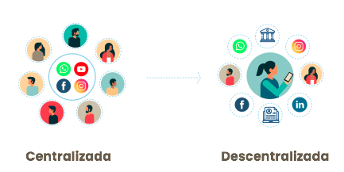

## ¿Qué es ai·di?
ai·di es una solución tecnológica de identidad digital descentralizada desarrollada en el marco del Proyecto DIDI “Inclusión Cívica, Social y Económica mediante modelos de Blockchain”, ejecutado por la A.C. DECODES en conjunto con BID Lab.

El Proyecto DIDI propone construir una identidad digital que certifique y valide datos sociales, cívicos y económicos, a través de la emisión de credenciales verificables, a partir de información certificada por terceros (instituciones o individuos). 

DIDI se materializa en la App Mobile ai·di (portadocumentos digital) y un portal web para la emisión y revocación de credenciales.

## ¿Por qué blockchain?
Blockchain o Cadena de bloques, puede ser entendido como un libro mayor contable (Ledger) o una base de datos en la que se registran múltiples transacciones. Es distribuido, es decir que se encuentra repartido en numerosas máquinas donde la información se encuentra replicada de forma idéntica, encriptada y verificada. Su tecnología de contabilidad distribuida (DLT), hace posible crear una identidad digital auto soberana que garantiza los requisitos de:
Privacidad: la información permanece protegida contra la divulgación no intencional
Control: el propietario de la identidad decide quién puede ver y acceder a sus datos y para qué propósitos
Portabilidad: el titular de los datos no se ata a un solo proveedor.

## ¿Cómo funciona DIDI?
La solución cuenta con una App Mobile, disponible para descarga por parte de quienes deseen gestionar sus credenciales formativo/laborales, transaccionales, patrimoniales y/o identitarias, entre otras.

Al crear una cuenta en la App DIDI, se genera un código de identificación que se conoce como DID (identificador descentralizado) el cual utiliza un protocolo de desafío/respuesta para probar la propiedad y permitir el uso de una identidad en particular a partir de la validación de datos biométricos con RENAPER (Registro Nacional de personas) y sobre el cual se asociará las credenciales verificables. 

Esta app se alimenta de credenciales emitidas por instituciones o entidades que deseen certificar información sobre el titular. Para esto, existe un módulo destinado a las entidades emisoras que cuenta con una solución backend y un portal web de emisión por el cual se podrá operar, gestionar, emitir y revocar credenciales.

Al dar de alta la solución para emisores en el servidor que este disponga,  se creará un DID al emisor, que será su identificador y por ende su firma al emitir una credencial.

Las credenciales verificables son medios por el cual podemos probar hechos sobre el propietarios de un DID, acreditando de manera digital y segura que una persona es portadora de ciertos atributos que tienen que ver con su identidad.

Una credencial verificable está compuesta por:
·	· DID del emisor (firma de la entidad emisora)
	· Datos del Titular (receptor) validados por el emisor
	· DID del Titular (receptor)

Usamos el protocolo de credenciales verificables de la identidad digital auto soberana (SSI) cuyos estándares fueron definidos por World Wide Web Consortium ([W3C](https://w3c.github.io/vc-data-model/)) , de manera que el usuario pueda resguardar su información de forma privada garantizando a su vez integridad de los datos y autenticidad de emisor.