## CREAR UNA CUENTA
### DESCARGA
Para descargar la aplicación es necesario ingresar en la tienda virtual, como por ejemplo Play Store o Google Play e ingresar en el buscador “aidi”. Seleccionar la opción que se muestra en la imagen:
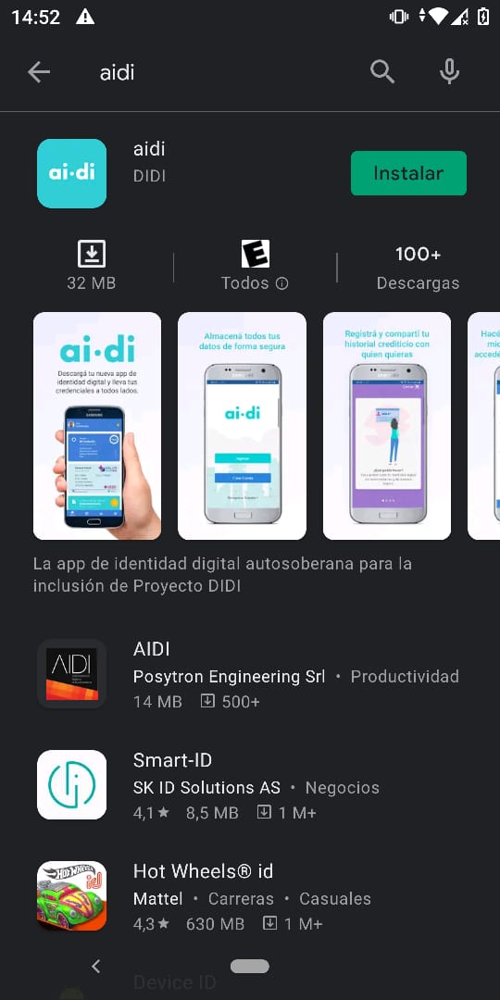

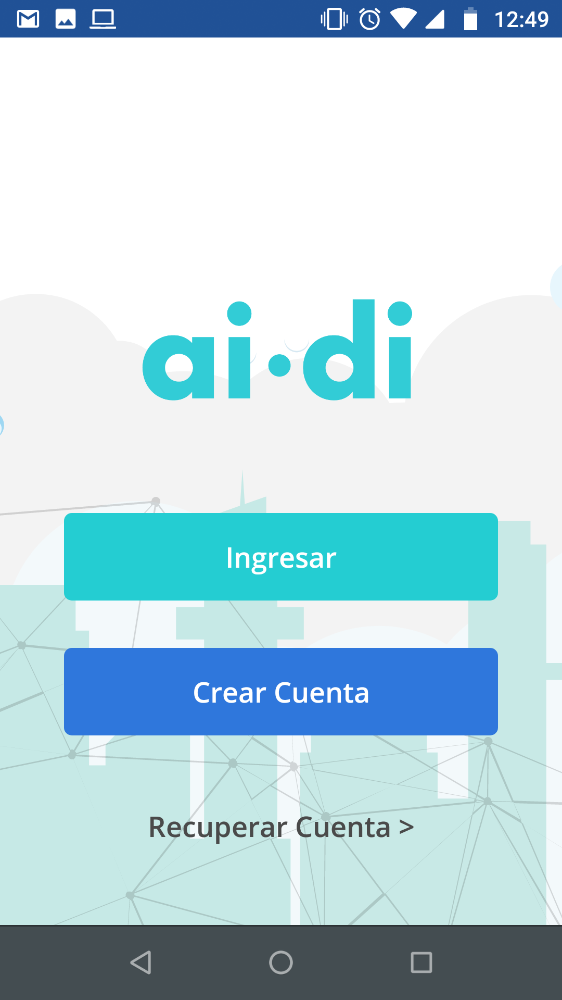
Una vez instalada la aplicación, ingresar y hacer click en **Crear Cuenta**.

Te darán la bienvenida las siguientes 3 pantallas introductorias:

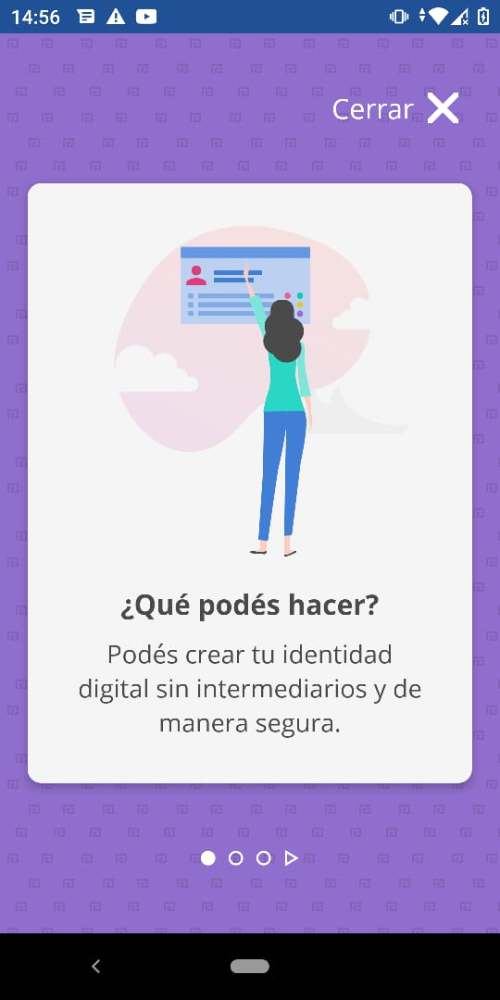
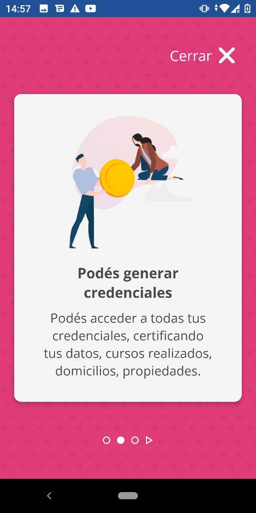
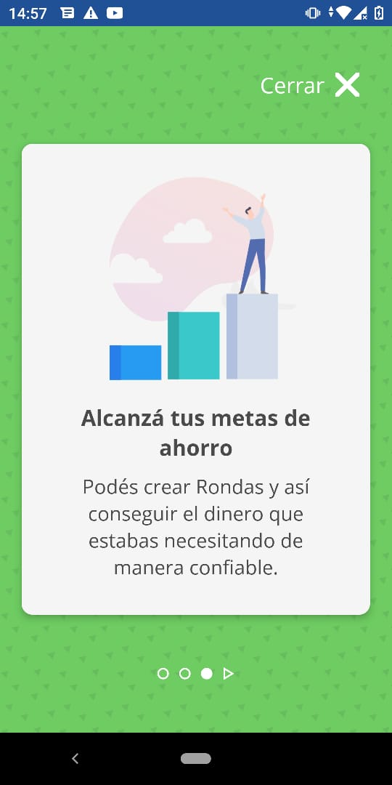

### REGISTRO DEL NÚMERO DE CELULAR

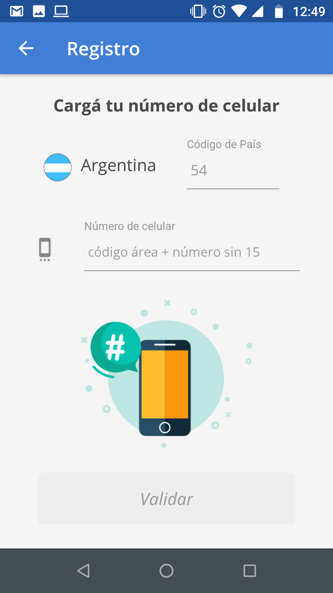

Completar  el código de tu país (54 para Argentina) y el número de celular con el código de área (011 para C.A.B.A.)

Presionar **Validar** para recibir un código por mensaje de texto que va a permitir verificar tu número de teléfono.

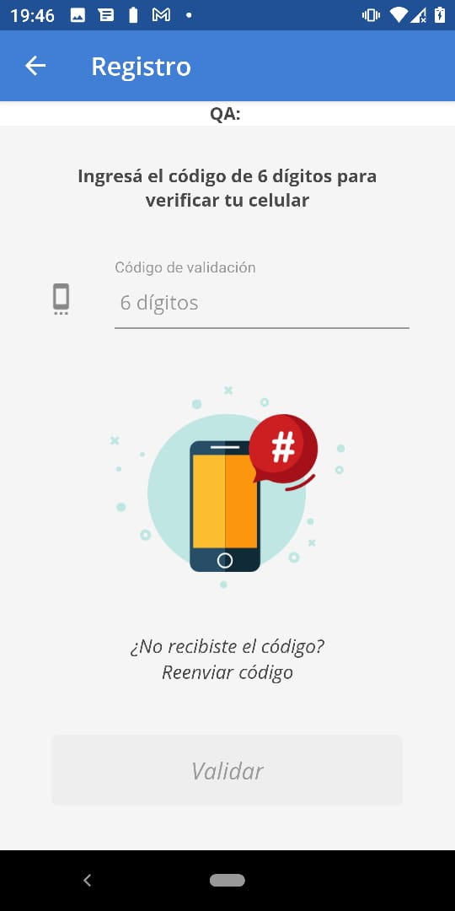
Una vez que se ingresa el código presionar **Validar**.

En caso de no recibir al cabo de unos minutos el mensaje de texto con el código presionar: **¿No recibiste el código?**

En este caso se va a reenviar el código de vuelta para que lo podamos registrar.

Una vez que se valida el código, va a aparecer en la pantalla que nuestro número de teléfono ha sido validado con éxito. Hay que pulsar **Siguiente** para continuar con el proceso de registro.

### REGISTRO DE NOMBRE Y APELLIDO

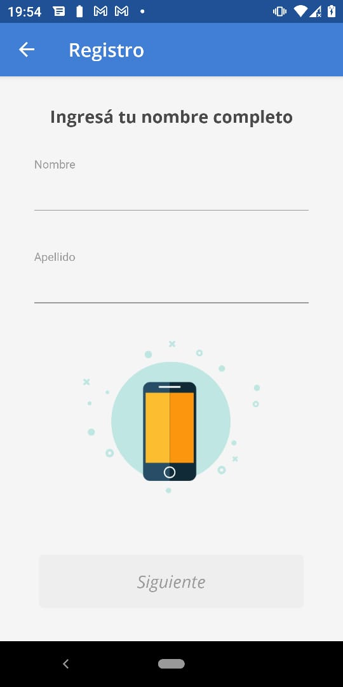

Ingresar tu nombre y apellido y luego presionar **Siguiente**

### REGISTRO DEL CORREO ELECTRÓNICO

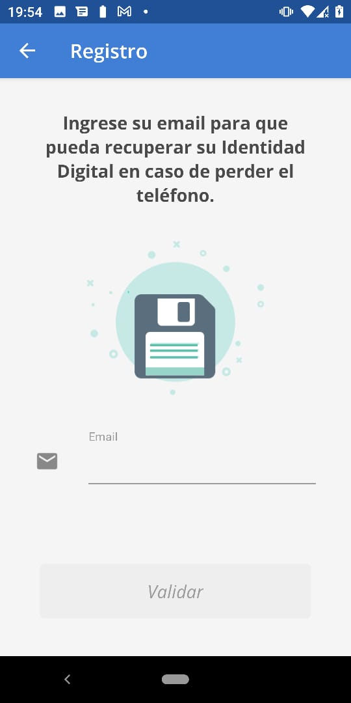
Ingresar el correo electrónico y presionar **Validar**. 
En el buzón de entrada de tu casilla de correo electrónico vas a encontrar un mail de confirmación de ai-di (la casilla es no-responder@didi.org.ar) con un código de 6 dígitos que puede tardar unos minutos en llegar.

> En el caso de no encontrarlo en  la bandeja de entrada, hay que revisar en correo no deseado.

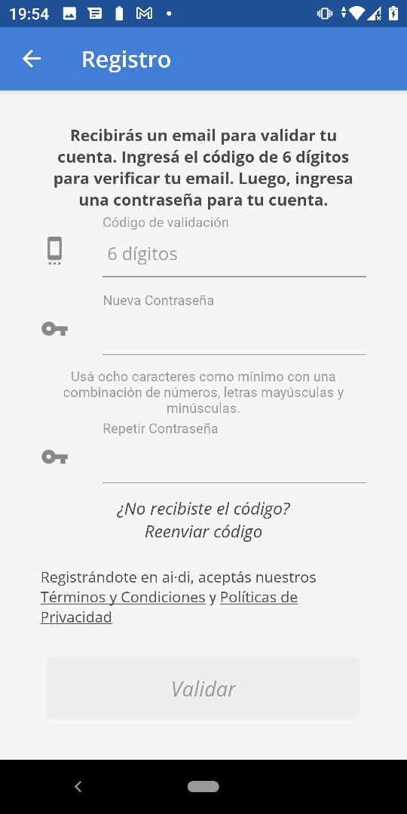

Se debe ingresar el código y luego la contraseña que deseas tener en DIDI. Recuerda que debe de tener: 
* 1 mayúscula 
* 1 número 
* 1 carácter especial (@ $ #..)

Por último, hay que repetir exactamente la misma  contraseña y presionar **Validar**.

## CREDENCIALES
### GENERAR CREDENCIAL DE IDENTIDAD

> Esta información no se almacena en ningún servidor de la app, sino que interactúa con los servicios provistos por Renaper. Si la identidad es validada exitosamente, ai·di emite una credencial de identidad titular de la cuenta que solo será almacenada en el dispositivo del titular.
>
> **ai·di no almacena las imágenes ni las informaciones involucradas en este proceso.**

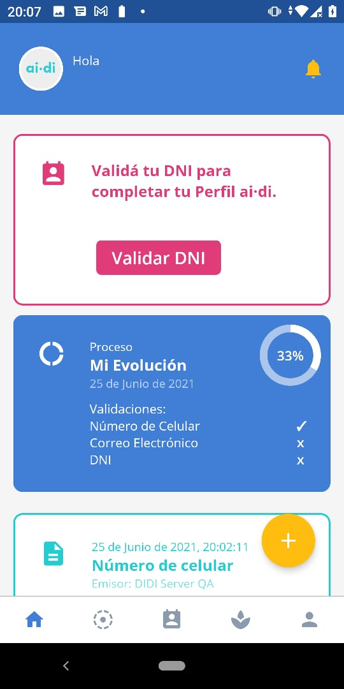

Desde la pantalla de inicio  se pueden ver credenciales e información general.  Presionando en **Validar DNI** se accede al proceso de validación con RENAPER.
> Hay que tener en cuenta las siguientes situaciones:
> * El proceso de validación lleva un tiempo.
> * Que haya mucha luz: Muchas veces en la cámara parece que se ve bien pero al haber luces más cálidas en la casa es motivo de una gran cantidad de rechazos.
> * Las personas que no cuenten con cámara en sus dispositivos o la misma esté rota o rayada (de tal manera que modifique la imagen) no podrán realizar este paso.
> * Es muy importante tener el DNI en la mano y acceso a internet.

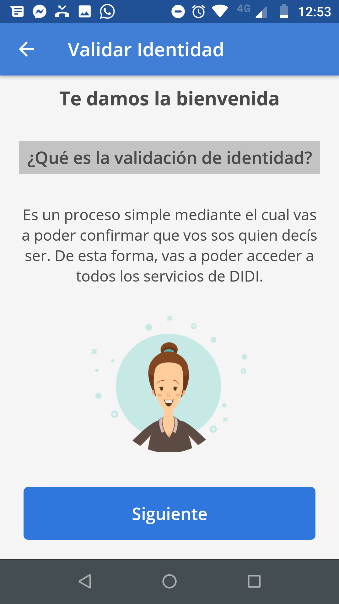
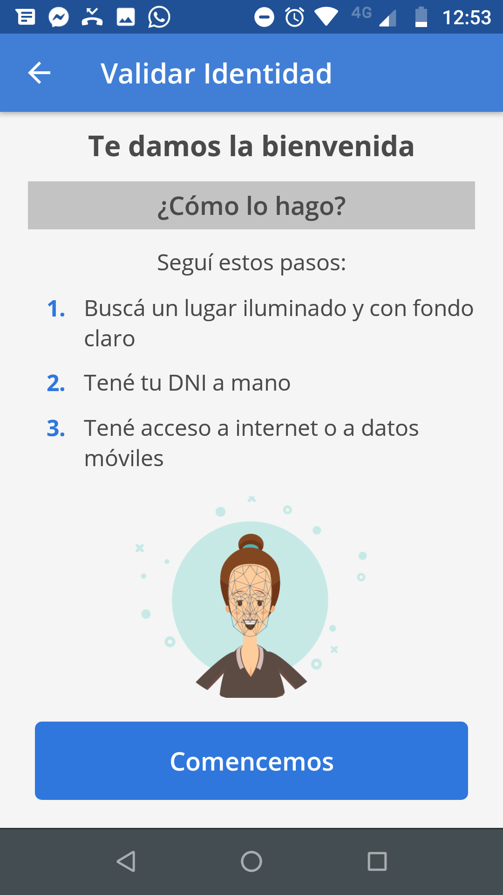

Como indican las primeras pantallas del proceso, será necesario tener el DNI a mano, acceso a internet y dar permiso de acceso a la app de la cámara. 
Luego de presionar en **Siguiente** y      **Comencemos** pondremos **Permitir**

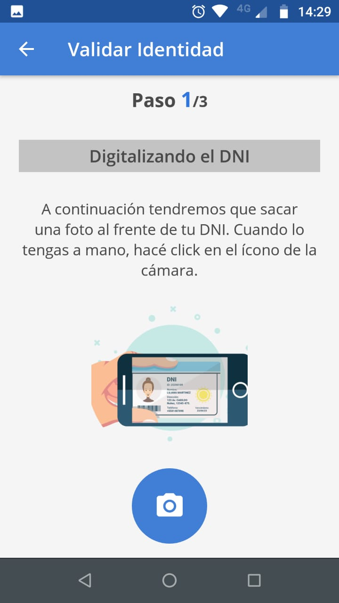

El primer paso de la validación es escanear la parte delantera del DNI: al presionar el ícono de la cámara   se abrirá un recuadro donde se tiene que apuntar y enfocar con la cámara del celular a nuestro documento.

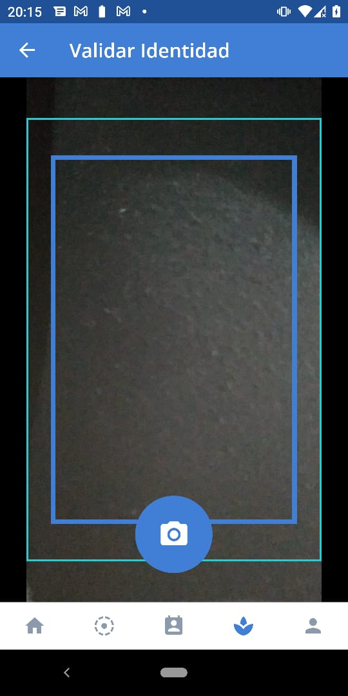

Es importante que esté en foco y se vea bien el código de barras,  que no se corte ninguna parte del DNI y no haya sombras importantes. 
Cuando se pone el tilde verde pasamos al paso 2 y repetimos con la parte de atrás del DNI.
En caso de que no haya salido bien el sistema te pedirá repetir la acción. 

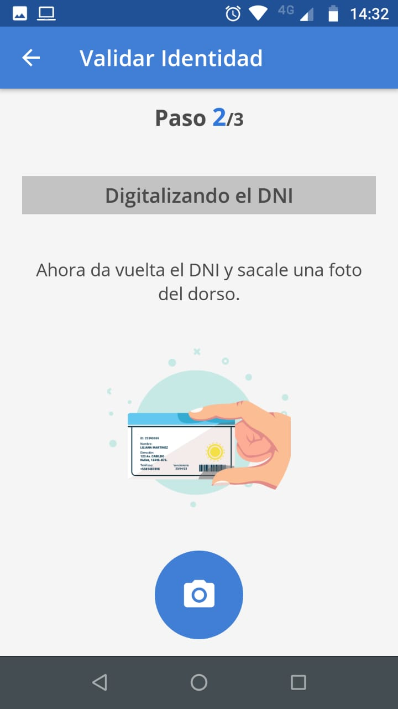

Hay que repetir el paso anterior pero con la parte de atrás del DNI.

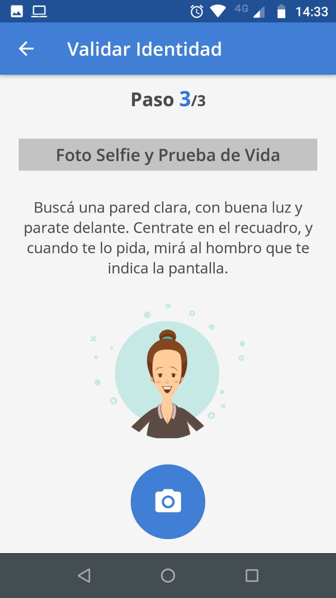

La prueba de vida es una instancia que sirve para demostrar que realmente somos quienes decimos ser. Es una medida de seguridad para evitar que cualquier persona con una foto nuestra pueda generar un usuario falso. 

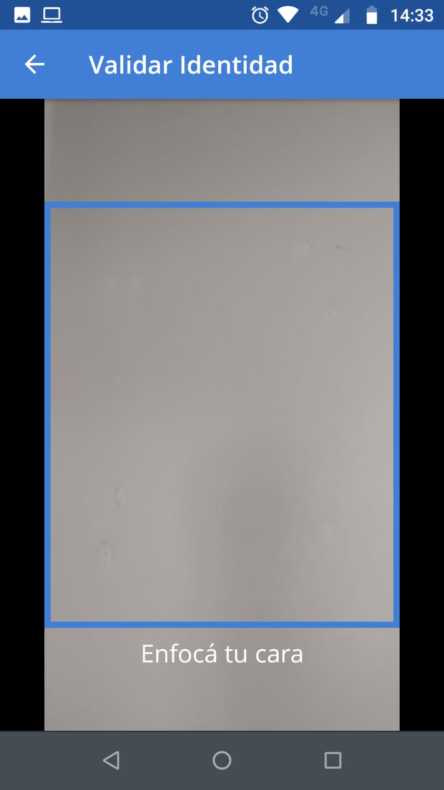

Lo primero es enfocar nuestras caras dentro del rectángulo azul. Automáticamente cuando el foco esté en posición correcta (el margen inferior a la altura de los hombros con la cara dentro del recuadro) la cámara va a empezar a escanear, a continuación hay que mirar a alguno de nuestros hombros (derecho o izquierdo) **es importante hacerlo lentamente**. Para finalizar hay que volver la mirada a la cámara.

Una vez que la imagen fue realizada de manera correcta apretar el botón y corroborar que los datos sean correctos.
Al finalizar este proceso se muestra todos los datos que acabas de ingresar. 

Asegurarse que los datos sean correctos sin ningún error en las letras y con las fotos visibles. En caso de que haya habido algún error, se puede volver hacia atrás con la flecha que se encuentra arriba a la izquierda e iniciar el proceso de validación desde cero.
Presiona **OK**
Al presionar **OK** se volverá a la pantalla de inicio de la app. 

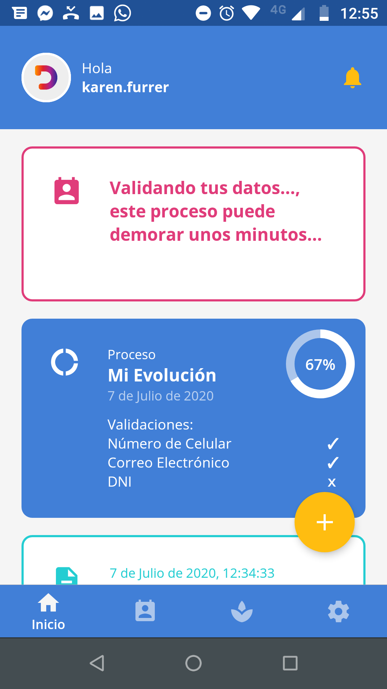

En un primer momento va a aparecer un cartel que dice: **“Validando tus datos...”**. 
Si la validación es exitosa, cuando se presione **OK**, la credencial de identidad va a aparecer en nuestra billetera virtual. En caso contrario aparecerá el botón para **Reintentar**.

 ### TIPOS DE CREDENCIALES
En la sección de inicio se van a encontrar todas las credenciales. Hay distintos colores que van a variar según el tipo de credencial que es:

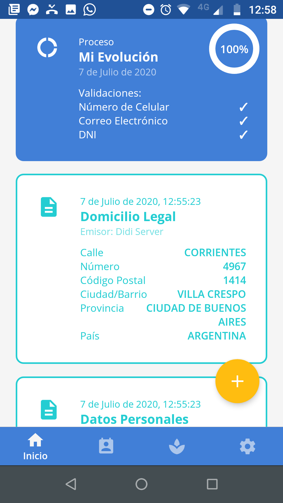

* Fondo blanco con color cian (verde agua) son emitidas por DIDI  (domicilio, celular, mail, datos personales) que previamente valida la información.
* Fondo cian (verde agua) letra blanca son credenciales emitidas por terceros en este caso Semillas.
* Fondo gris con letra blanca son credenciales revocadas

Con el registro de usuario se emiten 2 credenciales automáticamente: correo electrónico y número de celular. Si se valida el DNI también se va a tener las credenciales de Datos Personales y Domicilio Legal y por último se podrá acceder a las credenciales emitidas por **Semillas**.

### COMPARTIR CREDENCIALES
Al presionar el ícono  naranja que aparece en la pantalla de inicio se despliega un menú donde aparece la opción de **Compartir**.

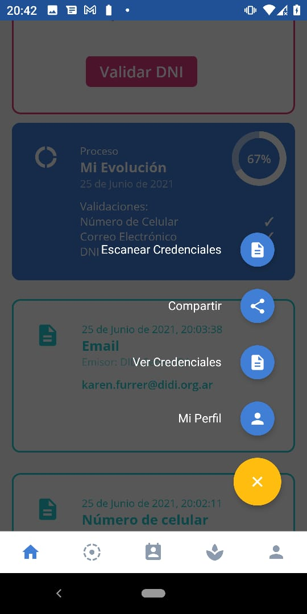

Seleccionar la credencial que se va a compartir. Se puede elegir más de una.

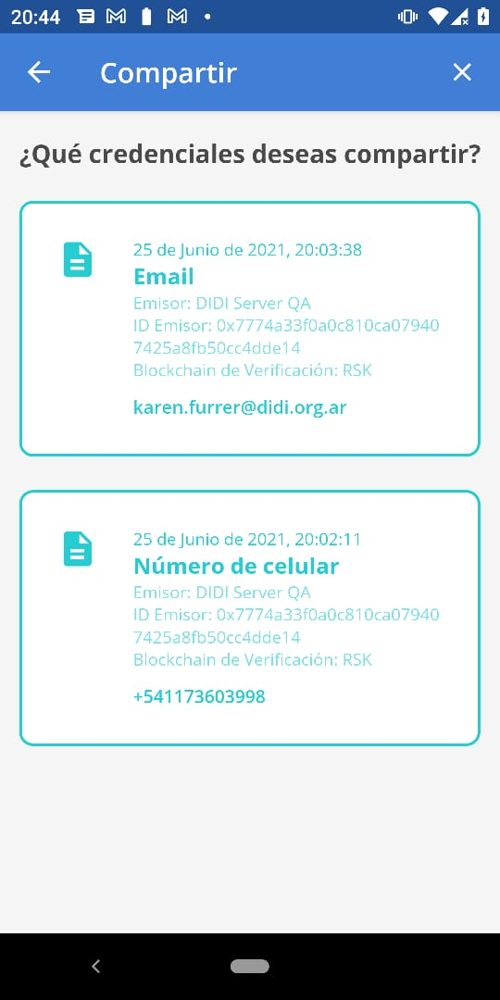

Pulsar el botón  para avanzar con el proceso.

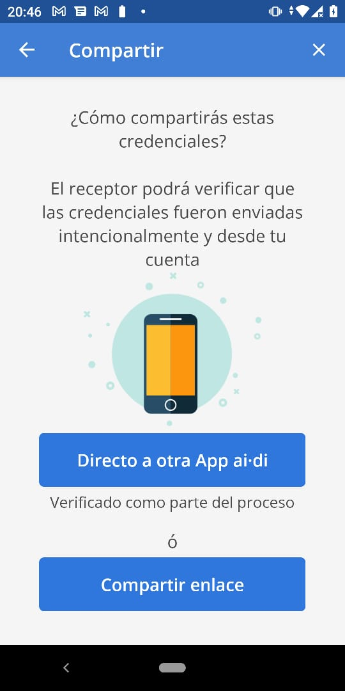

Hay dos opciones para compartir las credenciales: 

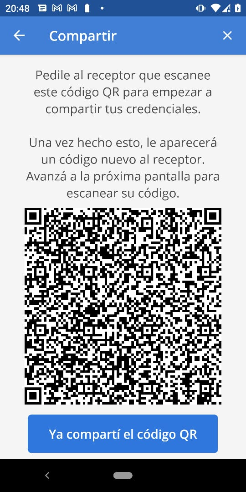

La primera es directa a través de ai-di mediante código QR y la otra es compartiendo el enlace que se genera.

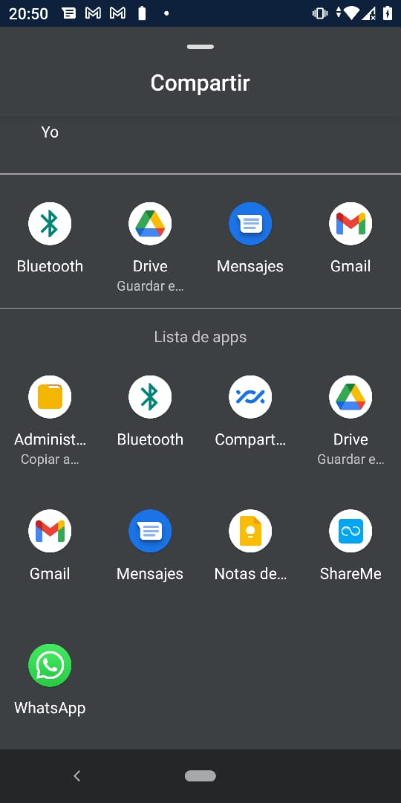

Por el contrario, al seleccionar la opción de **Compartir enlace** se despliegan todas las opciones para elegir la red social o medio por el cual se puede compartir el enlace, por ejemplo: whatsapp, instagram, también se puede copiar el enlace. Una vez que se selecciona un medio para compartir, va a llegar un mensaje similar al que vemos a continuación (mensaje enviado vía Whatsapp).
<!--  -->
El enlace nos va a llevar a una página web en la que se muestra la información de la credencial que nos compartieron.

## SEMILLAS
### SOLICITAR CREDENCIALES
Para ingresar, se hace desde el botón de Semillas que se encuentra abajo a la derecha.
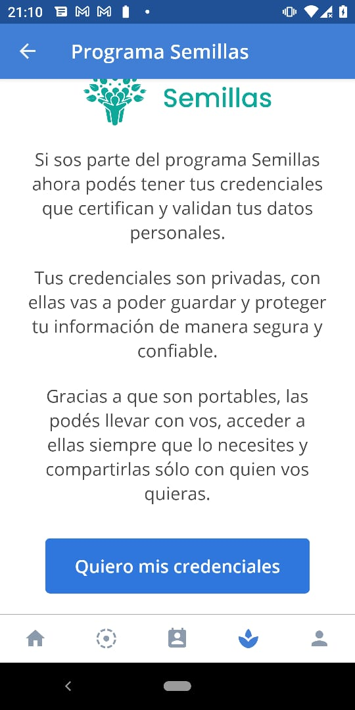

Va a aparecer una breve presentación de la organización. Hay que presionar **Quiero mis credenciales.** Es importante que esta acción se haga luego de validar la identidad con el DNI ya sea generando las credenciales pertinentes o mediante Semillas.
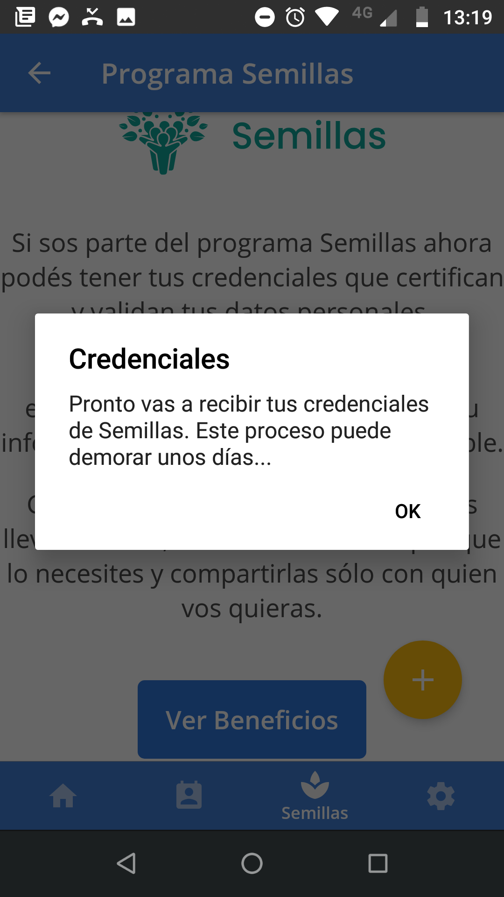

Para solicitar nuestras credenciales Semillas, hay que enviar el código de usuario y número de DNI a la entidad (para realizar la acción nos solicita permiso). Presionar **Acepto** y luego **OK**.
Mientras se espera que Semillas valide y envíe las credenciales, va a aparecer un cartel dentro de un recuadro azul, similar al que se puede ver en la imagen, que va a reemplazar el botón de **Quiero mis credenciales**, evitando que se soliciten nuevamente.

### PRESTADORES DE SERVICIO
Al obtener las credenciales emitidas por semillas, se habilita la opción **Ver Beneficios** que permite acceder al listado de todos los prestadores posibles.

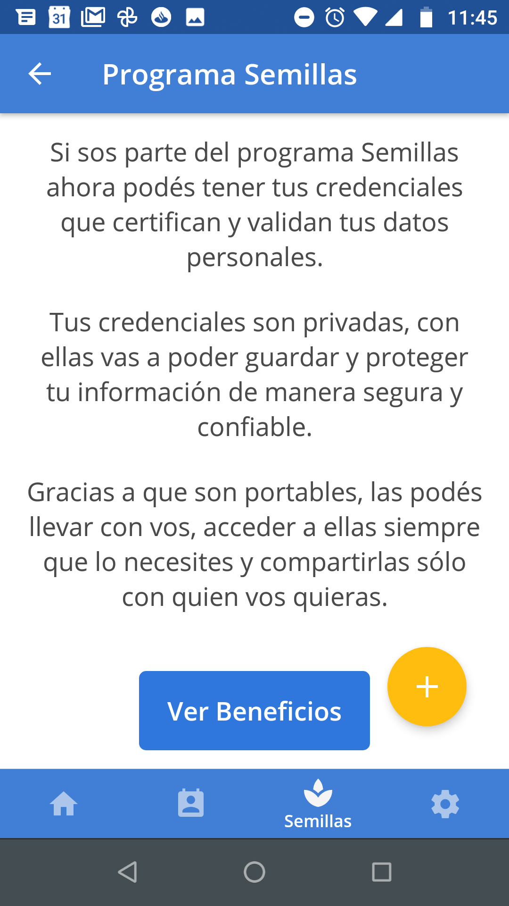

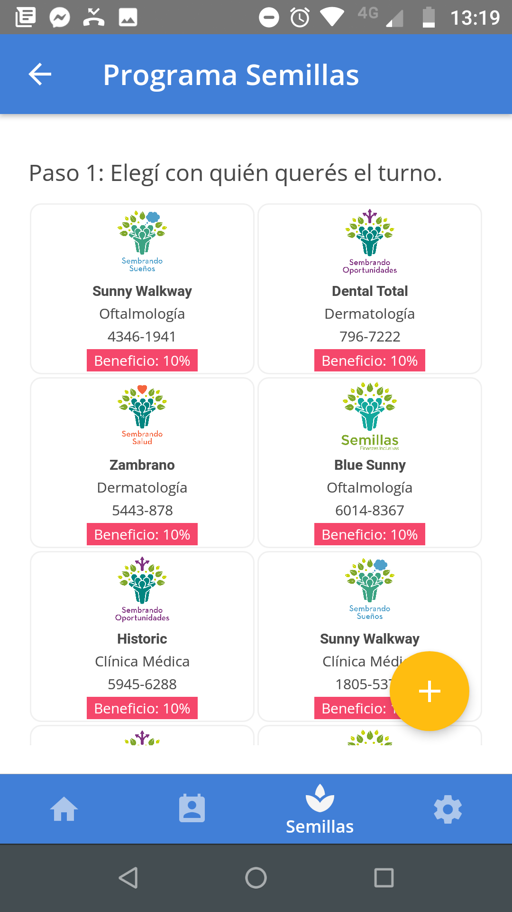

Se puede utilizar la barra para filtrar por categorías según la necesidad. Las categorías fueron establecidas por Semillas, son las mismas que se usan para categorizar sus créditos.
<!--  -->
<!--  -->
Una vez seleccionado el prestador que se requiere, se va a consultar por quién va a usar el beneficio. Puede ser para el titular o para alguien del grupo familiar declarado en Semillas. Presionar **Siguiente** para mostrar la información que va a compartir la app.
<!--  -->

Al poner **Compartir**, se envía un correo electrónico con esa información. Este correo tiene como objetivo anticipar a la empresa o entidad que un usuario/a de Semillas quiere comunicarse y utilizar sus servicios. No reserva el turno, comparte la información para que cuando el usuario/a se comunique, el prestador ya tenga la información necesaria para brindarle el servicio.
Para finalizar, se abren las opciones de comunicación establecidas por el prestador. Estas pueden ser un número de teléfono al que llamar y/o un número de contacto de whatsapp al cual escribir para terminar de coordinar efectivamente el turno en caso de ser necesario.

### VALIDACIÓN ALTERNATIVA CON SEMILLAS
En el caso de que haya problemas con el proceso de validación, existe un método alternativo.
Presionar en “Quiero mis credenciales” y luego en **Validar identidad**.

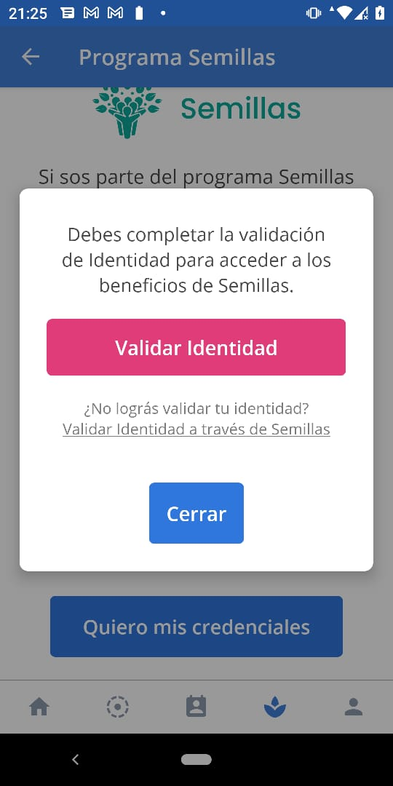

Hay que completar los espacios de DNI (sin puntos ni espacios), nombre y  apellido. Luego presionar **Validar DNI con Semillas**.

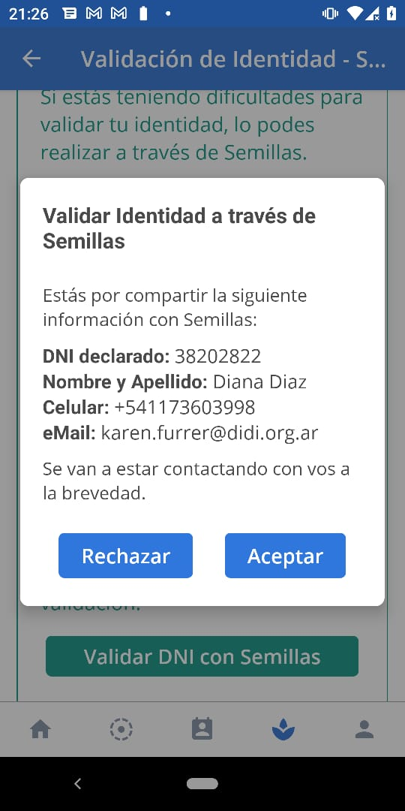

**Aceptar** el envío de información. 

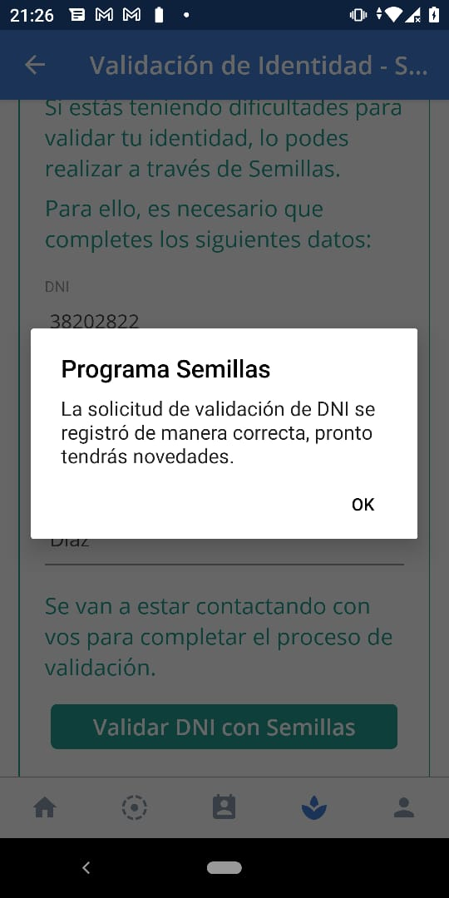

En caso de que haya algún inconveniente o se reporte un error, por favor ponerse en contacto con la asesora de Semillas o con el soporte técnico de DIDI (Se puede contactar en esta [dirección](https://proyecto-didi.atlassian.net/servicedesk/customer/portal/3/group/-1))
