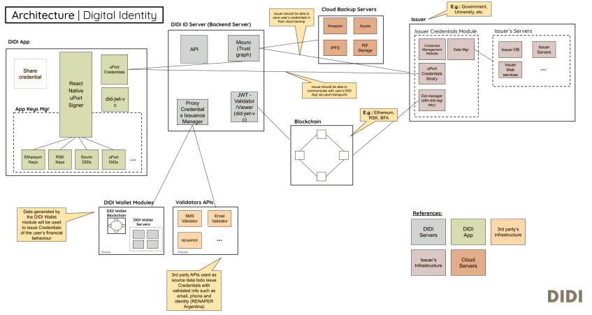

## Arquitectura

### DIDI Issuer Backend
**Brief**
> El issuer permite a distintas entidades autorizadas por el didi-server a generar y emitir
certificados que podrán ser accedidos por los dueños de los mismos desde didi.

**Repo**
- https://github.com/ong-bitcoin-argentina/DIDI-SSI-Issuer-Module

### DIDI Issuer Frontend
**Brief**
> TBA 
**Repo**
- https://github.com/ong-bitcoin-argentina/DIDI-SSI-Issuer-Module

### DIDI Credential Viewer/Validator
**Brief**
> La app credential viewer permite la visualización de credenciles que fueron compartidads anteriormente mediante la app AIDI. 

**Repo**
- https://github.com/ong-bitcoin-argentina/DIDI-SSI-JWT_Validator_Viewer

### DIDI App SDK
**Brief**
> TBA 

**Repo**
- https://github.com/ong-bitcoin-argentina/DIDI-SSI-app_sdk

### DIDI Mobile App
**Brief**
> La app mobile es el principal medio de interacción con los usuarios. Desde allí se permite ver y copartir las credenciales. 

**Repo**
- https://github.com/ong-bitcoin-argentina/DIDI-SSI-Mobile

### DIDI Mouro (Trust Graph Service)
**Brief**
> uPort Trust Graph Server (aka EdgeServer)

**Repo**
- https://github.com/ong-bitcoin-argentina/DIDI-SSI-mouro_didi

### DIDI Server
**Brief**
> TBA

**Repo**
- https://github.com/ong-bitcoin-argentina/DIDI-SSI-Server
