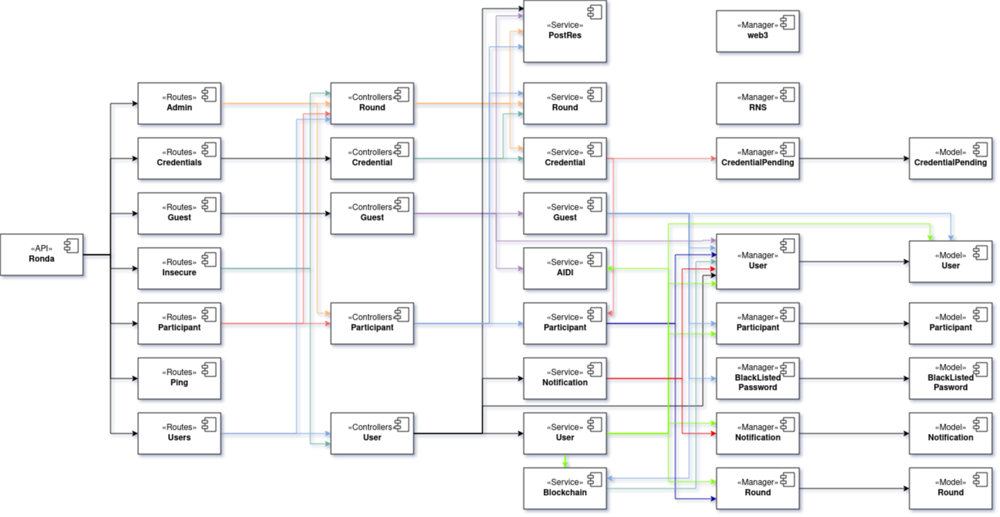

DIDI-SSI-Ronda es un monorepo que cuenta con una API desarrollada con Express.js, una app mobile desarrollada en React Native y 2 Smart Contracts desarrollados en Solidity. 
Esta aplicación interactua con DIDI-Server para obtener información de los usuarios de ai·di a fin de loguearse e integrarse entre sí.

Los diferentes colores en las líneas no tienen un significado específico. Es para seguir con mayor facilidad las dependencias. **A -> B** representa que el módulo **A** utiliza a **B**

## API
### Rutas/Controladores
*TBA*

### Services
#### api/services/aidi.js
Este servicio se encarga de verificar y actualizar los usuarios en DIDI Server.

#### api/services/blockchain.js
Representa todas las interacciones con blockchain. Hay una relación de 1:1 con los métodos de RNS y los Smart Contract de Ronda. Además, se encarga de las transacciones de transferencias de fondos a las wallets de los users.

#### api/services/credential.js
Emite credenciales a los participantes de las rondas, tanto al iniciarse (con fecha de expiración al finalizar la ronda)como al finalizarla.

#### api/services/guest.js
Se encarga de manejar los register, login y verificaciones de cuentas.

#### api/services/notification.js
Se encarga de enviar a los user y marcar como leídas las notificaiones. Parte de esta funcionalidad se encuentra en api/helpers/notfications/

#### api/services/participant.js
Representa la interacción de un participante con una ronda. Con cada interacción, envía una notificación al administrador de la ronda.

#### api/services/postRes.js
Son trabajos que quedan pendientes luego de enviar la respuesta al cliente. 

#### api/services/round.js
Permite la creacion y modificación de rondas. Además de la funcionalidad necesaria para guardar en DB las actualizaciones de estado de la ronda. 

#### api/services/user.js
Se encarga de recuperar usuarios y realizar las uniones con las colecciones de rondas y participantes para entregar la información completa del usuario.

### Managers
#### api/managers/blacklisted_password.js
Representa una lista de password que no se deben utilzar, debido a ser muy simples o muy utilizadas.

#### api/managers/credentials_pending.js
Este modelo representa las credenciales pendientes de emisión.

### api/managers/external_auth.js
*TBA*

#### api/managers/notification.js
Representa las notificaciones al usuaio que fueron enviadas y el momento en que se visualizan.

#### api/managers/participant.js
Representa un participante en una ronda.

### api/managers/rns.js
Este manager gestiona el resolver de RNS. Actualmente no se encuentra en uso.

#### api/managers/round.js
Es una ronda dentro del sistema. Contiene la información actual de la misma. Esta debe estar en sync con la blockchain.

#### api/managers/user.js
Son los usuarios verificados y sin verificar dentro del sistema ronda. 

#### api/managers/web3-client.js
Gestiona la instancia del cliente web3. Actualmente no se encuentra en uso.

## Smart Contracts
*TBA*

## App Mobile
*TBA*