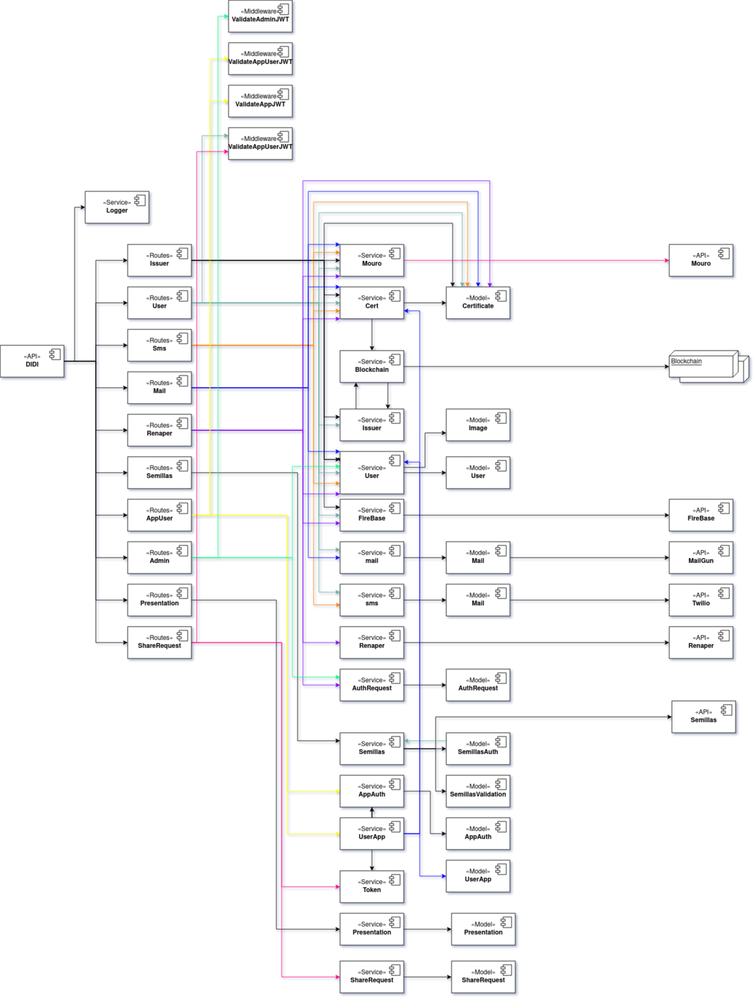

DIDI-SSI-Server es el nodo central de AIDI, permite almacenar los datos de recuperación de usuario y actúa como intermediario entre los demás módulos y mouro, validando certificados y evitando que issuers no autorizados puedan emitir certificados.
Se encuentra desarrollando en NodeJS, y  ExpressJs. Además, almacena sus datos en MongoDB.

> Los diferentes colores en las líneas no tienen un signifaco específico. Es para seguír con mayor facilidad las dependencias. **A -> B** representa que el módulo **A** utiliza a **B**

### Rutas
#### /admin
Se utilizan para obtener información confidencial de los usuarios. Están protegidas por un middleware que chquea que el JWT pertenezca a un Admin.

#### app y user auth
> /appAuth y /userApp
Estas rutas se utilzan para crear Applicaciones autorizdas y usuarios pertencientes a estas apps.

#### /issuer
Desde estas rutas se atuoriza y revoca issuers para emitr credenciales.
También, se le permite a los issurers registrados con anterioridad emitir y revocar credenciales.
Otra funcionalidad de interés es crear shareRequest. 

#### Mail
> /sendMailValidator y /reSendMailValidator
Estas rutas se utilizan para enviar y reenviar el mail con el código de validación y su posterior verificación. Estas rutas se encuentrn protegidas por rate-limit.

#### /presentation
Estas rutas almacen pesentaciones y le asigan un id. Mediante es ID se permite recuperar las presentaciones.

#### /renaper
Estas rutas se encargan de enviar los datos a renaper para ser validados. Además, se crea un registro en donde se almacena el estado de la verificación en la collection authRequest.

#### /semillas
TBA

#### /shareRequest
Estas rutas permiten almacenar y recuperar shareRequest.

#### Sms
> /sendSmsValidator y /verifySmsCode
Estas rutas se utilizan para enviar por sms con el código de validación y su posterior verificación. Estas rutas se encuentrn protegidas por rate-limit.

#### /user
EStas rutas son las encargads de crear usuarios, modificarlos y eliminarlos. 
También se encuentra la funcionalidad de verificar credenciales

Renovar el tokn de firebase

### Services
#### AppAuth
Este serivcio agrega en la base de datos el registro necesario para autorizar una app. También permite obtener una app autorizada a partir de su did. 

#### AuthRequest
Un AuthRequest es una validación de identidad contra un proveedor de identidad. 

#### Cert
Genera credenciales para mail, número de teléfono, etc. 
Crea shareRequests y petitions que se utilizan para solicitar información al usuario.
Se verifican los certificados para número telefónico, emil, etc.

#### Firebase
Este servicio se utiliza para comunicarse con FireBase. Actualmente solo para envir push notifications.

#### Issuer
Este servicio se encarga de la gestión de issuers registrados. Crear y editar issuers. También de renovar las delegaciones y de realizar el callback al issuer.

#### Mail
Se encarga de enviar email a través de mailgun. De realizar la verificación de los códigos de emails y de almacenar el estado de validciones de email. El email se alamacena encriptado en la db. Este servicio y el modelo Mail son iguales a los de sms, deben ser refactorizado para mejorar la mantenibilidad. 

#### Mouro
Realiza llamadosa Mouro para btener el hash del backup, guardar y revocar credenciales. Y también para hacer comprobaciones se existe una credencial.

#### Presentation
Crear y recuperar presentaciones por id. Las presentaciones tienen una expirción definida en las costantes del server.

#### Renaper
Realiza una validciones de dni contra RENAPER (REgisto NAcional de PERsonas). Este proceso cuenta con los pasos de enviar imagenes del frente y reverso del dni , selfie de la persona. El resultado de este proceso es un grado de confianza de la validación

#### Semillas
Gestiona los requests al backend de semillas y el manejo de los modelos de validciones y authrequests Entre ellos se encuentran un CRUD de validaciones, obtencion de prestadores, 

#### ShareReques
Se pueden crear shareRequest y recuperar por su id. ADemás, el recuperarlo se verifica que el ISS enviado sea el de AUD especificado en el shareRequest.

#### sms
Se encarga de enviar sm a través de twilio. De realizar la verificación de los códigos envidaos mediante sms y de almacenar el estado de validciones de números telefónicos. El número se alamacena encriptado en la db. Este servicio y el modelo Phone son iguales a los de mail, deben ser refactorizado para mejorar la mantenibilidad. 

#### Tokens
Decodificacion y verificaciones de JWT.

#### UserApp
Se crean relaciones entre usuarios y apps y se permite recuperar una app autorizada mediante un did de usuario.

#### User
Este servicio resuelve la creacion y modificaciones de usuarios. También se realizan el login, recuperación de cuenta y las verificaciones por numero telefónico y email utilzado.
