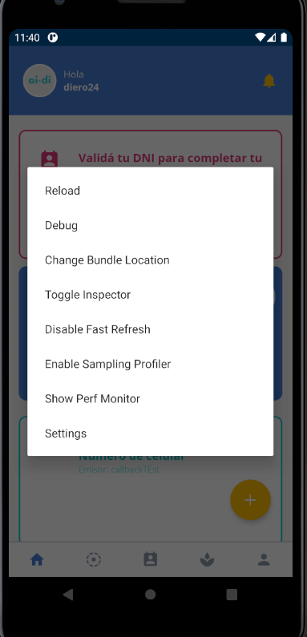
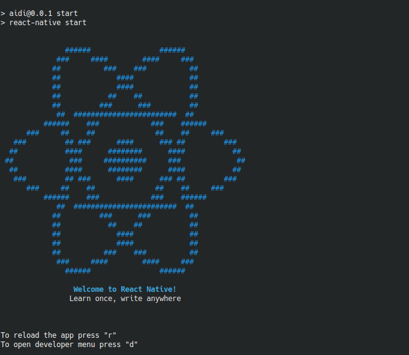
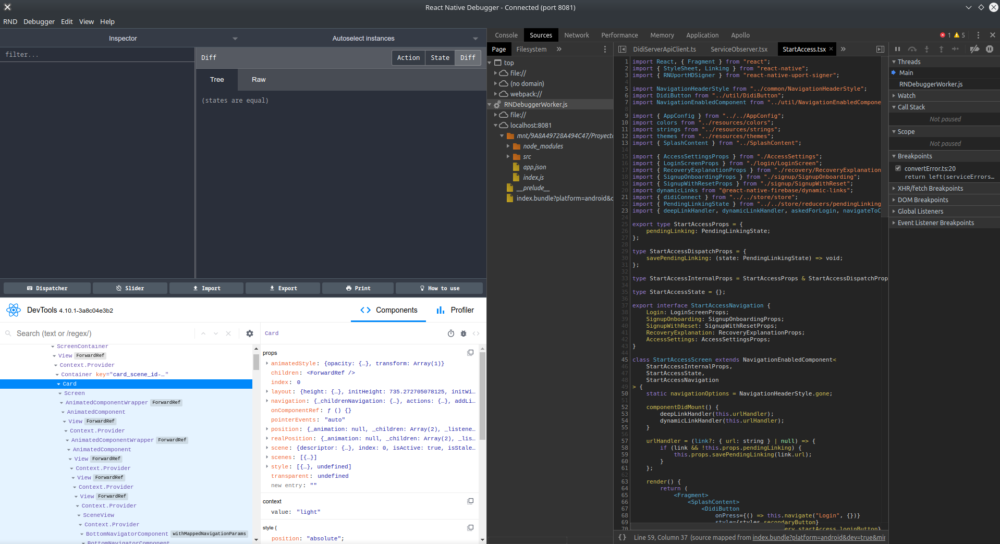

## Participación en versiones de prueba

Actualmente contamos con 3 canales de distribución **Pruebas internas**, **Pruebas cerradas**, y **pruebas abiertas**. Cada uno de estos canales se corresponde con un ambiente distinto.

### Pruebas internas
Este canal está dedicado a devs y testers que deseen probar nuevos features durante su desarrollo. En caso de darte de alta en este canal, no olvides contactar al equipo de desarrollo para ayudarte con la configuración.

* [aidi](https://play.google.com/apps/internaltest/4699792894966829510)
* [ronda](https://play.google.com/apps/internaltest/4698214270068764420)

### Pruebas cerradas
Las pruebas cerradas se utilizan para probar las últimas features, y su integración con el resto de las funcionalidades.
Para comenzar a participar de las pruebas cerradas, date de alta a través de los siguientes links:
* aidi: 
    * [web](https://play.google.com/apps/testing/com.aidi) 
    * [playstore](https://play.google.com/store/apps/details?id=com.aidi)
* ronda: 
    * [web](https://play.google.com/apps/testing/com.aidironda2)
    * [playstore](https://play.google.com/store/apps/details?id=com.aidironda2)

 
### Pruebas abiertas
Las pruebas abiertas son el último paso antes de lanzar a producción. En este punto la estabilidad de los features es óptima, se utiliza principalmente para detectar problemas de uso y estabilidad en la integración con lo ya desarrollado.
Para comenzar con este canal, podés darte de alta en los siguientes links:
* aidi: 
    * [web](https://play.google.com/apps/testing/com.aidi)
    * [android](https://play.google.com/store/apps/details?id=com.aidi)

* ronda: 
    * [web](https://play.google.com/apps/testing/com.aidironda2)
    * [playstore](https://play.google.com/store/apps/details?id=com.aidironda2)

## Reporte de errores

Los Issues y reportes son muy valiosos para este proyecto.

* Los reportes de bugs ayudan al proyecto a ser más estable y evita que esos mismos errores sucedan en el futuro.
* Una pregunta, además de resolver las dudas, muestra dónde los colaboradores pueden mejorar la experiencia del usuario.

## Debug apps aidi y ronda

### Acceso al menú del desarrollador en la aplicación
Podemos acceder al menu de desarrollador de varias maneras, método abreviado `Ctrl+M` en Windows y Linux.

Tambien se puede acceder desde la consola sobre la que estamos corriendo nuestra app pulsando la `d`

### React Native Debugger
Es una standalone app basada en el debugger oficial de React Native, incluye React Inspector / Redux DevTools. En ella podremos tener todas las funcionalidades en una sola herramienta facilitando el trabajo a la hora de identificar errores, ver propiedades de algun elemento, etc. 
Con la aplicación abierta y teniendo activado el modo debug desde el menú de desarrollador antes mencionado podremos acceder a todos los elementos de nuestra app, por ejemplo: si activamos `Toggle Inspector` y hacemos click en algun componente de nuestra aplicación se nos posicionará directamente en el componente y podremos ver todas sus propiedades.

Para mayor información de su instalación y configuración consultar [React Native Debugger](https://github.com/jhen0409/react-native-debugger).

## Solicitar funcionalidades

* Las ideas son una valiosa fuente de contribuciones que podés hacer
* Si necesitas realizar una actividad que no está soportada por el proyecto. Probablemente hay otros users con la misma necesidad que se beneficiarán también
* ¿Tenés un caso de uso? No dudes en crear un issue para compartirlo y ponerte en contacto con el equipo

## Resolver bug o agregar funcionalidades

### Branches
* Los desarrollos actuales se llevan acabo desde `develop`. Todas las nuevas features deben salir desde este branch y volver a mergearse a `develop`
* Los releases se mergean a `master` una vez estabilizadas.
* Para vincular la rama con las incidencias de Jira:  
Al utilizar `Create branch`, incluir la clave del issue en el nombre del branch cuando cree el branch.
Por ejemplo, si nombra su branch como "TIS-2-feature", automáticamente pasará el issue TIS-2 de 'Tareas pendientes' a 'En curso'.

Para mayor información consultar [guía sobre referencias de issues en Jira](https://support.atlassian.com/jira-software-cloud/docs/reference-issues-in-your-development-work).

### Commits
* Al hacer commit, en lugar de `git commit -m 'Your message'`, se utiliza: `git cz` o simplemente `cz`. Se le solicitara la siguiente informacion, generando automaticamente un commit en base la misma:
    - Mensaje del commit
    - Jira Issue Key(s)
    - Workflow command
    - Tiempo utilizado
    - Comentario
* En caso de problemas al hacer el commit, realizar una instalacion global de *cz-jira-smart-commit* y *commitizen* con el siguiente comando `npm i cz-jira-smart-commit commitizen -g`

:::info Importante
Antes de hacer un commit, verificar que la dirección de email configurada en Git coincida con la de Jira.
En caso de ser diferente, configurarla [en un unico repositorio](https://docs.github.com/es/github/setting-up-and-managing-your-github-user-account/setting-your-commit-email-address#setting-your-email-address-for-a-single-repository) o [de manera global](https://docs.github.com/es/github/setting-up-and-managing-your-github-user-account/setting-your-commit-email-address#setting-your-commit-email-address-in-git)
:::

### Pull Request
* Una vez realizado el Pull Request, no realizar force-push para mantener la línea de correcciones.
* Agregar una descripción que indique los cambios que se hicieron y la razón de los mismos.
* `Create/Reopen/Decline Merge pull request` Asegúrese de que el pull request incluya commits que hagan referencia al issue.
Por ejemplo, si crea un pull request que tiene "TIS-3" en el título, automáticamente pasará el issue "TIS-3" de "En curso" a "En revisión". Si vuelve a abrir, rechazar o fusionar el pull request, también se transferirá el issue "TIS-3" en consecuencia.
* `Start/Reject/Abandon/Close review` Incluir la clave del issue en el título de la review cuando cree la review.
Por ejemplo, si nombra su review "TIS-4 New story" y comienza la review, automáticamente pasará el issue TIS-4 de "En progreso" a "En revisión". Si rechaza, abandona o cierra la review, también se transferirá el issue "TIS-4" en consecuencia.

### Proveedores 
* Crear una nueva rama(branch) para el feature desde `develop`
* Revisa y resuelve conflictos con otras ramas.

### Contribuidores open source
Dentro de la lista de issues, hay etiquetas `help wanted` y `good first issue`. Estas son las mejores opciones para empezar a interiorizarse en el proyecto.

Las contribuciones se realizan mediante Forks del proyecto. Para esto

* Crear un fork del proyecto. Para mayor información sobre el proceso de Forks consultar [guía de Atlassian](https://www.atlassian.com/git/tutorials/comparing-workflows/forking-workflow) y [documentaión en Github](https://docs.github.com/es/github/getting-started-with-github/fork-a-repo)
* Crear una nueva rama (branch), a partir de `develop` y trabajar sobre esta nueva rama
* Al realizar el pull request, indicar **issue** releacionados. Utilizar closes #133 si el pull request resuelve algún issue de a lista

## Puntos importantes

* Actualizar `README.md` con los detalles de los cambios en caso de ser necesario. Esto incluye env varibles, puertos, ubicaciones de los archivos y configuraciones del contenedor Docker.
* Revisar ortografía
* Verificar los check de estado luego de crear el Pull Request

Gracias por contribuir