## Consola de proyectos

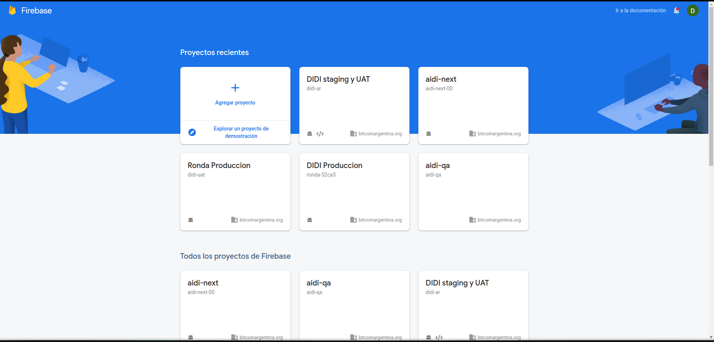

## Sección donde se encuentran las configuraciones principales en nuestro proyecto

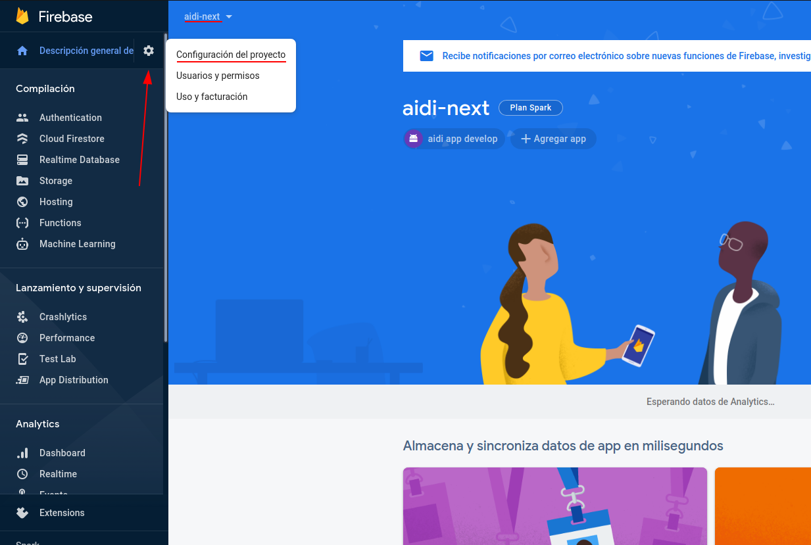

## Configuración del proyecto

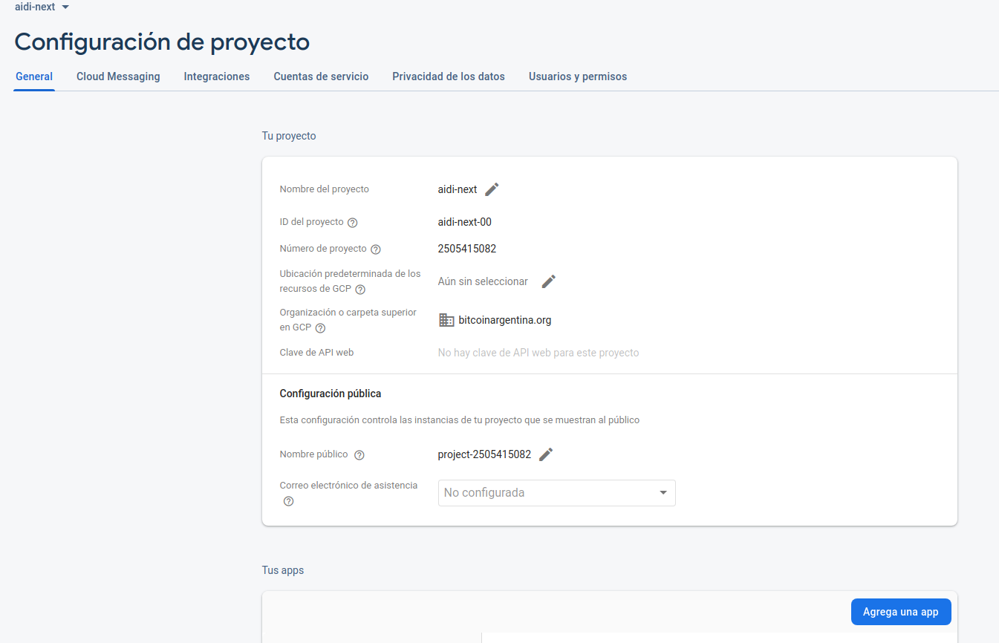

`Nombre del proyecto`: Es un identificador único que defines para tu proyecto de Firebase. Puede aparecer en las URL o los nombres de algunos recursos de Firebase y, por lo general, debe considerarse un alias de conveniencia para referirse al proyecto.

`ID del proyecto`: Es un identificador canónico y único a nivel global que define Google para tu proyecto de Firebase. Úsalo cuando configures integraciones o realices llamadas a las API de Firebase o de servicios de terceros.

`Nombre publico`: Este es el nombre que verán los usuarios cuando observen instancias públicas de tu proyecto. Por ejemplo, este nombre aparecerá en los correos electrónicos que reciban los usuarios después de crear una cuenta en tu app.

## Menú para agregar nuestras apps o web

Seleccionando cualquiera de los iconos podemos agregar nuestras apps o paginas webs de una manera muy sencilla.

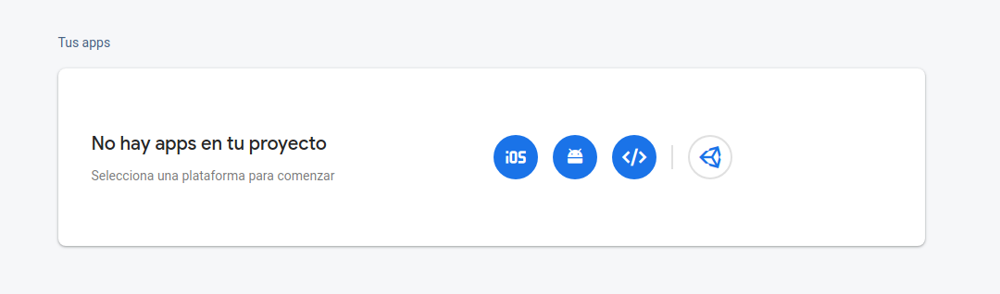

## Agregar Firebase a tu app Android

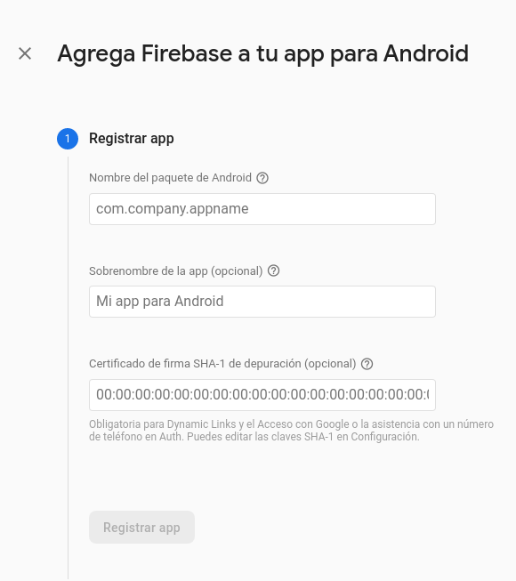

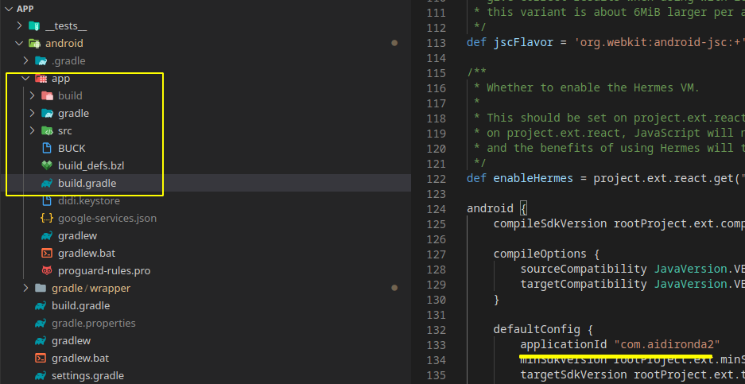

**Aclaración:** Por lo general, el nombre de tu paquete es el valor de applicationId en el archivo build.gradle de nivel de app.

## Descargar archivo de configuración

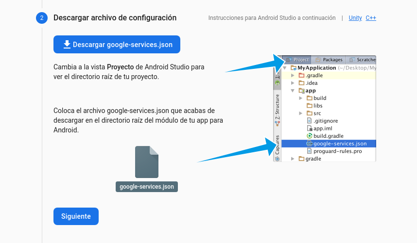

## Agregar el SDK de Firebase

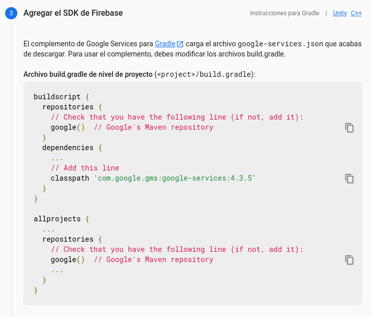

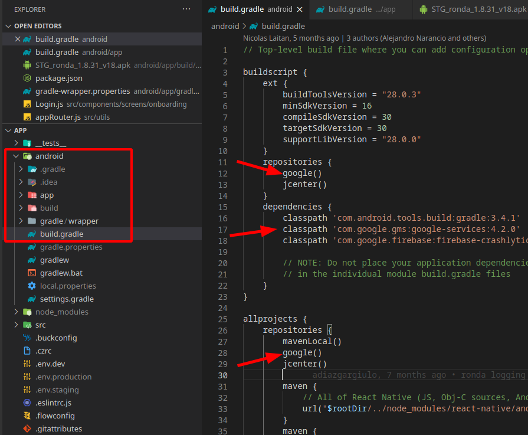

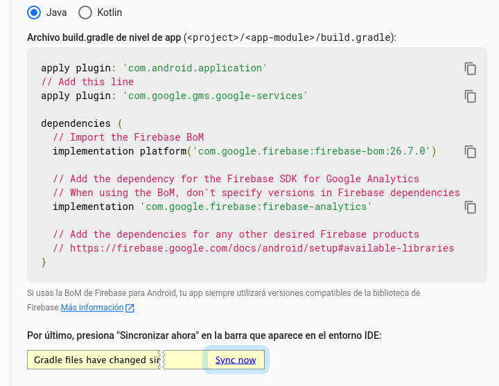

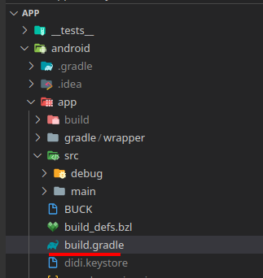

## Vista de tu app integrada en Firebase

`ID de la app`: Usa este número para identificar tu app cuando te comuniques con el servicio de asistencia de Firebase.

`SHA`: Necesaria para la conexión de los Dynamic Links y accesos con Google.

## Generacion de clave y almacén de claves

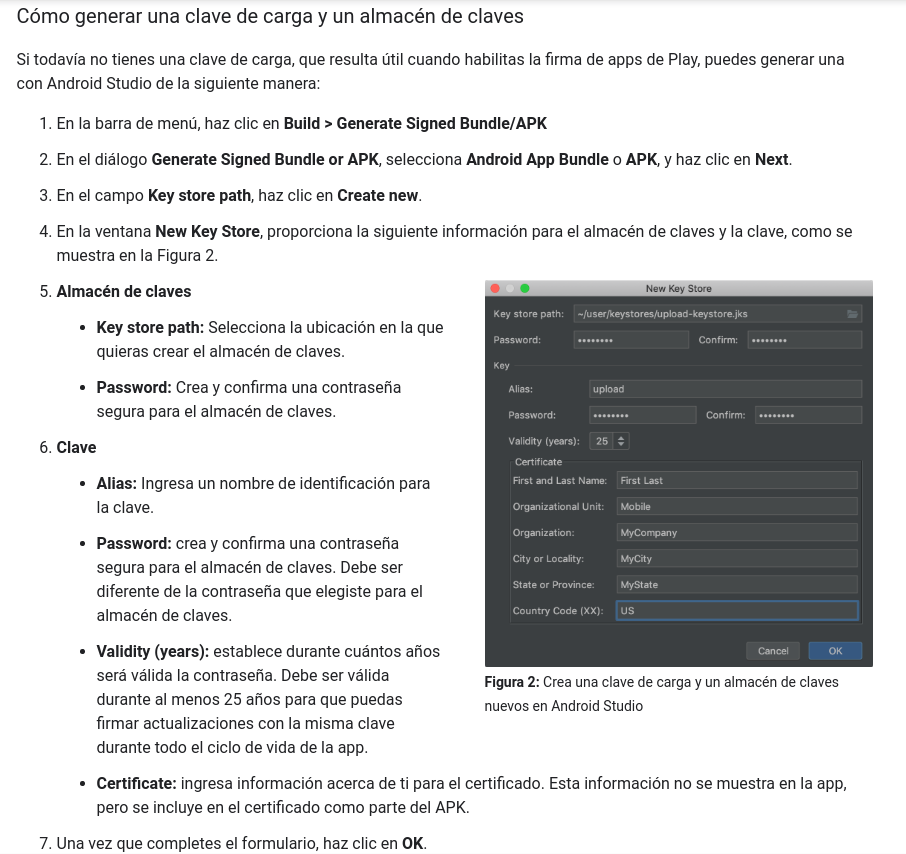

**Aclaración:** Si ya tenes generadas las firmas podes acceder desde la consola con el siguiente comando 

`keytool -list -v -alias <your-key-name> -keystore <path-to-keystore>`

## Configuración de Dynamic Links

`Firebase Dynamic Links` te permite implementar vínculos. En nuestro proyecto se utilizaron para conectar el login de ronda con aidi y obtener las credenciales. A su vez, en los casos en los que la aplicación ai·di aún no esté instalada, se configuró este Firebase Dynamic Link para que redireccione a la descarga de ai·di desde Google Play Store.

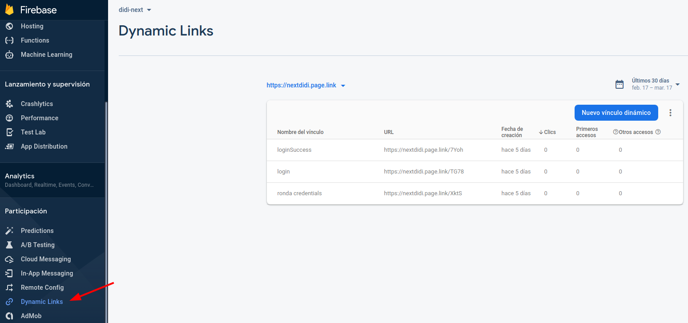

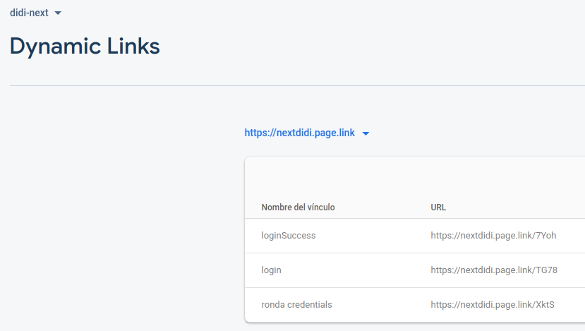

`loginSuccess`: DeepLink en aidi el cual si se autenticó bien envía el token hacia ronda, en caso negativo lo retorna vacío.

`login`: DeepLink en ronda, donde hace referencia al login de ai·di que, en caso de no estar instalada en el dispositivo, redirige a la descarga de ai·di desde Google Play Store.

`ronda credentials`: DeepLink en ronda, donde se pide las credenciales cargadas en aidi.

## Variables de Entorno aidi y ronda

En aidi y ronda se configuraron variables de entorno para poder diferenciar los distintos ambientes, en este ejemplo Next.

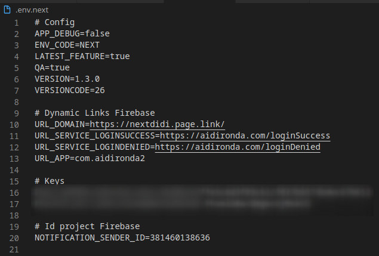

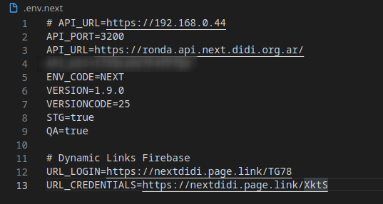

## Analytics y Crashlytics

Tenemos configurado `Analytics` y `Crashlytics` tanto en aidi como en ronda. En cuanto al primero nos permite generar informes para entender cómo se comportan los usuarios en la aplicación, se capturan automáticamente diversos eventos y propiedades del usuario, también podemos definir nuestros propios eventos personalizados para medir aquellos factores importantes para nosotros o la empresa. Por su lado, Crashlytics, es similar a Analytics pero recopila informes de fallas sobre nuestra aplicación.

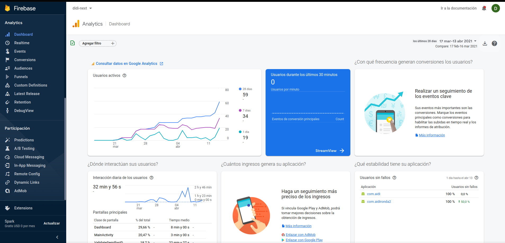

### Eventos en Analytics

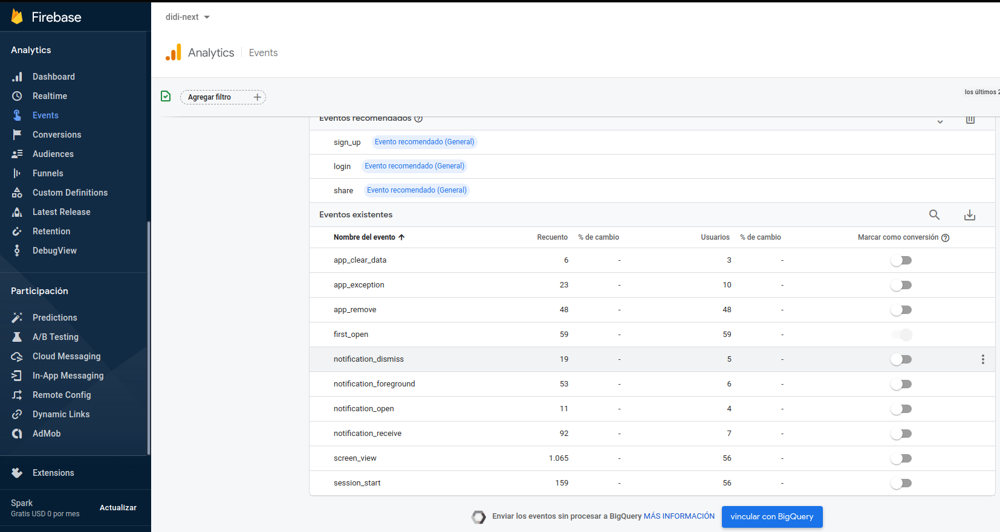

**Aclaración:** Ya que tenemos las dos aplicaciones en el mismo proyecto de Firebase, podemos aplicar filtros para ver los eventos de cada una.

[Información y métodos de interés para React Native](https://rnfirebase.io/reference/analytics).

### Ejemplo de evento vistas de pantallas

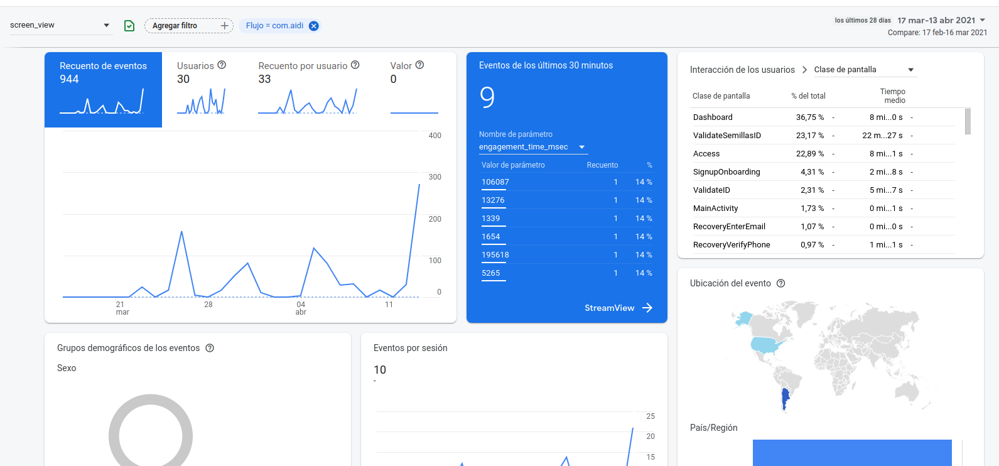

Para mayor información de su configuración consultar:

- [Analytics](https://firebase.google.com/docs/analytics/get-started?hl=es-419&platform=android).

- [Crashlytics](https://firebase.google.com/docs/crashlytics/get-started?hl=es&platform=android).

## Links de interés 

[Fundamentals](https://firebase.google.com/docs/guides?authuser=2).

[React Native Firebase](https://rnfirebase.io/).