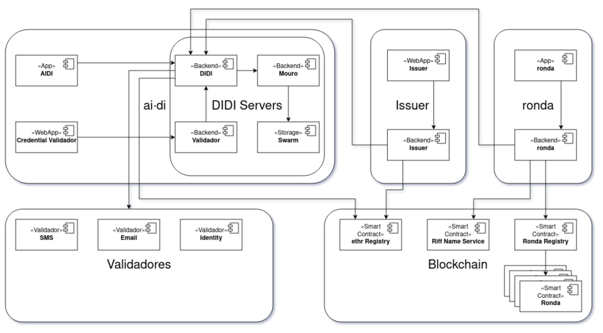
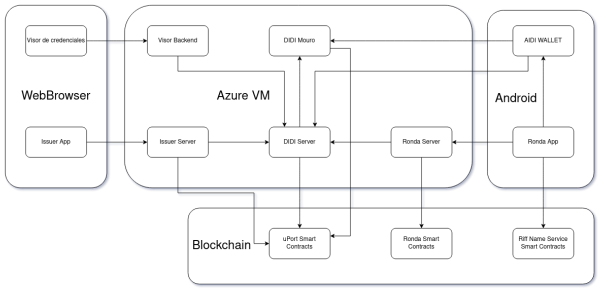

Se describen a continuación los componentes de Proyecto DIDI. Para mayor detalle de cada uno de estos ver la sección **Descripción técnica**.

## DIDI Issuer module

El issuer permite la creación de templates, pre credenciales y emisión de credenciales. Una vez emitidas las credenciales se almacenan en Mouro y son accedidas los los usuarios desde ai·di.

[**Repositorio backend**](https://github.com/ong-bitcoin-argentina/DIDI-SSI-Issuer-Module)

[**Repositorio frontend**](https://github.com/ong-bitcoin-argentina/DIDI-SSI-Issuer-Module)

## DIDI Credential Viewer/Validator

La app Credential Viewer permite la visualización de credenciales y presentciones compartidas mediante ai·di.

[**Repositorio**](https://github.com/ong-bitcoin-argentina/DIDI-SSI-JWT_Validator_Viewer)

## DIDI App SDK

El SDK provee clientes para DIDI Server y Mouro. Está basado en [fp-ts](https://gcanti.github.io/fp-ts/) (programación funcional con typescript)

[**Repositorio**](https://github.com/ong-bitcoin-argentina/DIDI-SSI-app_sdk)

## DIDI Mobile App

La app mobile ai·di es el medio principal de interacción con los usuarios finales. Desde allí los usuarios pueden recibir, ver y compartir sus credenciales.

[**Repositorio**](https://github.com/ong-bitcoin-argentina/DIDI-SSI-Mobile)

## DIDI Mouro (Trust Graph Service)

Es un fork de uPort Trust Graph Server (aka EdgeServer). Se resposabiliza de almacenar y controlar el acceso a las credenciales.

[**Repositorio**](https://github.com/ong-bitcoin-argentina/DIDI-SSI-mouro_didi)

## DIDI Server

DIDI Server es el componente CENTRAL de Proyecto DIDI. Su responsabilidades son:
* Registro de usuarios y gestión de sus claves pivadas.
* Comunición con users mediante push, sms y email.
* Gestión de ShareRequest
* Gestión de Presentation
* Comunicación con Semillas
* Verificación de identidad con RENAPER
* Gestión de emisores
* Gestión de aplicaciones

[**Repositorio**](https://github.com/ong-bitcoin-argentina/DIDI-SSI-Server)

## Entorno de ejecución

El entorno de ejecución de los componentes se encuentra descirpto mediante el siguiene diagrama:

El **visor de credenciales** y el **Issuer front** son 2 aplicaciones para navegador, desarrolladas en React. Por otro lado, la **wallet ai·di** y **ronda** se encuentran desarrolladas en React Native, con soporte sólo para Android.

El **backend del visor de credenciales**, el **Issuer back**, **DIDI server**, **ronda server** y **Mouro** se encuentran dockerizados, corriendo en una máquina virtual Azure.

En cuanto a **Blockchain**, se encuentran en uso los **uPort ethr registry** en **RSK**, **BFA** y **LACChain**. Además **ronda** utiliza **RIF Name Service** y **Ronda Registry** en **RSK**.