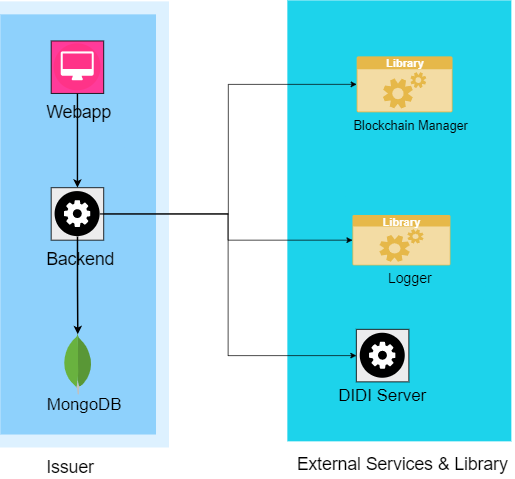

DIDI SSI Issuer es una herramienta con la que se crean y emiten credenciales. Para poder emitir y almacenar credenciales en Mouro, previamente se registra en DIDI Server. Una vez almacenadas las credenciales en Mouro, estas son enviadas hacia ai·di. Además de esto, cunado el usuario requiere credenciales de un emisor, este recibe credenciales por parte del titular desde la aplicación ai·di. 

Cuenta con un backend responsable de almacenar usuarios del emisor con sus roles, almacenar los templates de las credenciales y de coordinar la emisión de las credenciales y asegurar que lleguen a Mouro. Se desarrolló en NodeJS y ExpressJs utiliza MongoDB para almacenar sus datos
El Frontend presenta la funcionalidad de la creación de templates y la emisión de credenciales de forma manual a los usuarios. Se utilizó React para el desarrollo.

A partir de estas 2 aplicaciones se crean y publican imágenes docker mediante el script [update and push](https://github.com/ong-bitcoin-argentina/DIDI-SSI-Scripts/tree/main/update-and-push). Una vez almacenadas en Azure Docker Registry, se realiza el deploy general de DIDI mediandte [DIDI SSI Deploy](https://github.com/ong-bitcoin-argentina/DIDI-SSI-Deploy) al ambiente correspondiente. Otra opció es realizar solo el deploy del issuer con el repositorio [DIDI SSI Deploy Issuer](https://github.com/ong-bitcoin-argentina/DIDI-SSI-Deploy-issuer).

### Overview
A continuación se muestra la interacción del issuer con otros servicios y librerías 

Blockchain Manager es una librería que se encarga de manejar la comunicación con la Blockchain y Logger es una librería que centraliza logs en azure. 

Dentro del código, se encuentra el termino "certificado", jwt que hacen referencia a las credenciales verificables o VC.

### Componentes Issuer backend
A continuación se muestra un detalle de los componentes dentro del issuer backend.

> Los diferentes colores en las líneas no tienen un signifaco específico. Es para seguír con mayor facilidad las dependencias. **A -> B** representa que el módulo **A** utiliza a **B**

### Repositorios

- [**Repositorio backend**](https://github.com/ong-bitcoin-argentina/DIDI-SSI-Issuer-module-backend)

- [**Repositorio frontend**](https://github.com/ong-bitcoin-argentina/DIDI-SSI-Issuer-module-frontend)

### Swagger url

[**api docs**](https://api.issuer.alpha.didi.org.ar/api-docs/)

### Rutas

#### /user
Este conjunto de rutas se crean, modifican y eliminan usuarios y administradores.
Dentro de estas rutas se encuentra el endpoint securaizado para crear el primer admin.
#### /participant
Se conoce como participantes a aquellos dids cargados en el listado del emisor y que luego se utilizan como input en los desplegables a seleccionar el titular al emitir un credencial.
#### /template
Se leen, crean, modifican y eliminan templates de credenciales.

#### /cert
Estas rutas permiten crear, modificar, elimnar u obtener credenciales.

#### /delegate
*TBA. Esperando implementación multiblockchain.*

Coordina las delegaciones. Este servicio genera la tx a la blockchain correspondiente, y luego almacena esa delegación en la DB local.

Este servicio tiene un bug, que no reconoce las delegaciones realizdas por fuera de la app. Es decir, si se realiza una delegcion en blockchain, no queda registrada en la app.
#### /register
Estas rutas permiten obtener, crear, editar y eliminar registros de delegacion de un nuevo emisor, sobre la blockchain elegida.
Dichos registros contienen Nombre, did y clave privada del nuevo emisor.
Provee también una ruta por la cual se obtiene la lista de blockchains disponibles.
 
#### /default
Se utiliza para crear los valores por defecto del template de credencial y la blockchain de verificación. 

#### /profile
Crud de perfiles. Cada perfil es un conjunto de permisos para leer, crear/modificar y eliminar en un módulo.

### Servicios
Los servicios se encargan de coordinar una acción y llevar a cabo una acción dentro del sistema. Para

#### Blockchain services
*TBA. Esperando implementación multiblockchain.*

#### Cert Service
Este servicio se encarga de crear credenciales a partir de templates para luego almacenarlos en DB local. 
Así como de modificar y eliminar credenciales.

#### Mouro service
*Este servicio no es lo que su nombre indica, debe ser refactorizado.*

Se encarga de crear credenciles verificables, para luego enviarlas a DIDI Server, o ser elimnadas en DIDI Server.

Otra funcionalidad con la que cuenta es enviar shareRequest a DIDI-Server. [Explicar que es un shareRequest y para qué sirve]

#### Delegate service
Se encarga de almacenar en DB local las delegaciones. El impacto real de las delegaiones se realiza en blockchain. 

A este servicio, lo debería llamar otro servicio que se ecuentre escuchando eventos en las distintas blockchain.

#### Default service
Se encarga de establecer la blockchain y el template por defecto. 

#### Token service
Este servicio es el más simple del Issuer. Se encarga de crear y verificar tokens vacios, firmados por el Issuer.

#### User service
Se encarga de crear, editar y elimnar usuarios. También se encarga de realizar el login.

#### Participant service
Los participantes son todos los dids sobre los qu se tiene información en el sistema. Este servico provee la funcionlidad para crear, edita y modificar. Además, para obtener listas de participantes por requestCode y templateId.
