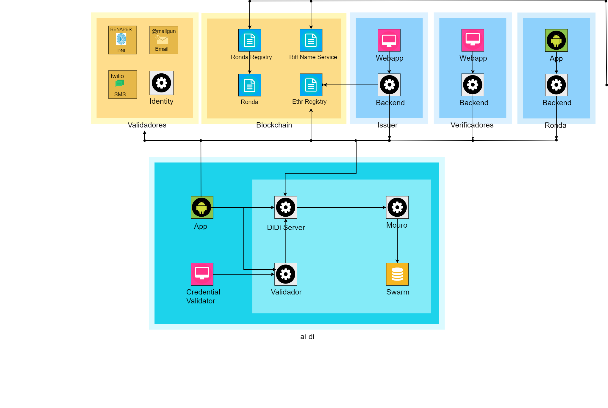
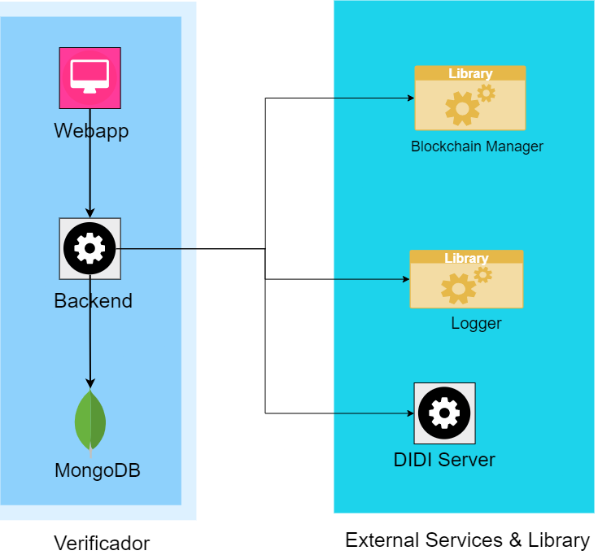

Verificador va ser una herramienta que permite generar presentaciones y validar credenciales verificables. Cuando el Verificador se da de alta con DIDI Server, las credenciales se almacenan en Mouro, y son enviadas a la app ai·di del titular (DID titular).

### Arquitectura con Verificador

### Overview Verficador
A continuación se muestra la interacción del verificador con otros servicios y librerías 

### Componentes Issuer backend
TBD

### Repositorios

TBD

### Swagger url

TBD

### Servicios
TBD