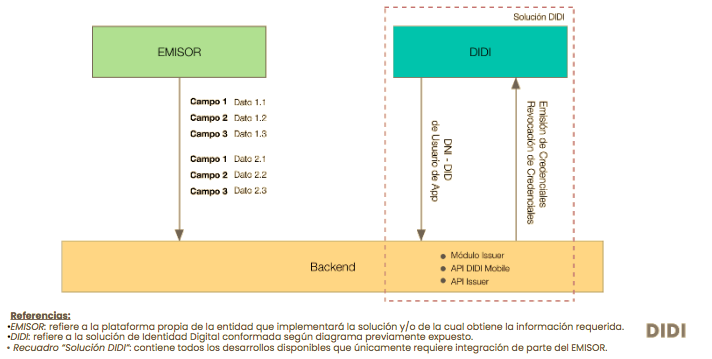

## Proceso de armado de un plan de implementación
Una de las finalidades de la emisión de credenciales verificables es entregarle a un tercero información con la que cuenta la entidad emisora sobre este, a fin de que este se vuelva titular de su información y pueda dar fe de esta ante otra institución o individuo (lo llamaremos 'validador') eliminando la necesidad de que el emisor deba intermediar para corroborar la información.
De esta forma, se propone un proceso más eficiente para el emisor, dado que debe realizar una única vez la afirmación sin necesidad de que se le solicite verificación cada vez que el titular a quien refiere la información deba presentarla ante un tercero.

Para definir una correcta implementación del uso de credenciales verificables, se deberán tener presente los siguientes pasos:
1. Identificar el objetivo del uso de las credenciales. Por ejemplo: Una institución financiera, al emitir una credencial sobre reputación crediticia de un beneficiario de un crédito, le está otorgando información propia y valiosa, que esta persona puede presentar a otra institución al momento de querer acceder a un crédito.

2. Identificar roles/actores. Es decir, entender quienes serán los titulares de las credenciales y quienes serán los receptores/validadores a los que el titular les presentará dichas credenciales.

3. Relevar los procesos de la entidad emisora, las reglas de este y la información de valor con la que cuenta.

4. Teniendo presente el objetivo, los actores y el relevamiento de procesos y de información, se definirán qué datos deberán contener las credenciales que se desea emitir de acuerdo a las decisiones operacionales, marco normativo, etc. (Por ejemplo: monto del crédito, monto de la cuota, estado del pago, etc.).

5. Definir cuales son las reglas propias de negocio a fin de identificar la lógica por la que se emitirán y/o revocarán las credenciales.(Por ejemplo, periodicidad de emisión de las credenciales, actualización de la información, etc.)

## Consideraciones Técnicas
Para evaluar los tiempos de desarrollo necesarios para avanzar en la emisión de credenciales se debe tener en cuenta que **DIDI proveerá**:

* Solución compuesta por el módulo emisor que deberá darse de alta en un servidor a cargo de la entidad emisora. Se contará con el código fuente y la documentación para una correcta implementación. (Se estima un tiempo de 3 a 4 horas) [ver [Arquitectura](localhost:3000/docs/arquitectura-overview) para más detalle]

* API Issuer: utilizada para la creación, emisión y revocación de las credenciales.

* API DIDI: expone información necesaria desde la app ai·di para identificar al receptor final de las credenciales a emitir. Informa el DID asociado a un documento nacional de identidad (DNI).

El **emisor** deberá resolver:
* Definiciones funcionales según reglas de negocio y campos disponibles. Esto implica, entre otras cosas, lógicas de emisión de credenciales, periodicidad en los procesos de consulta, de emisión y de actualización de la información.
* Definición de qué tipos de credenciales se desea emitir (Por ejemplo: Formativas/historial laboral/reputacionales).
* Definición de campos que almacenará la credencial.
* Dimensionamiento del proceso según cantidad de consultas a efectuar en su base de datos, cantidad de datos y parámetros.
* Desarrollo API con campos/datos necesarios según lo relevado a integrar con solución DIDI.
* Desarrollo de proceso de creación de pre-credenciales (implica desarrollo de reglas de emisión/revocación) y guardado en DB del emisor. Así como, endpoint para recepcionar DNI-DID de API DIDI.

## Arquitectura

<!--stackedit_data:
eyJoaXN0b3J5IjpbMTY2MDMyNDE0OF19
-->