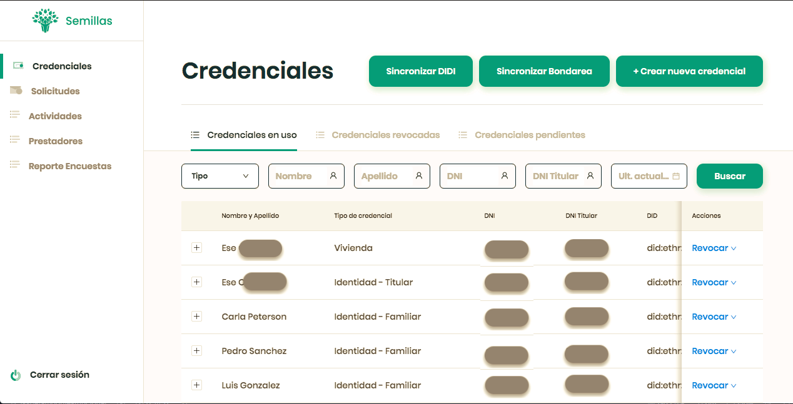
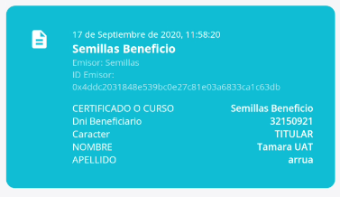
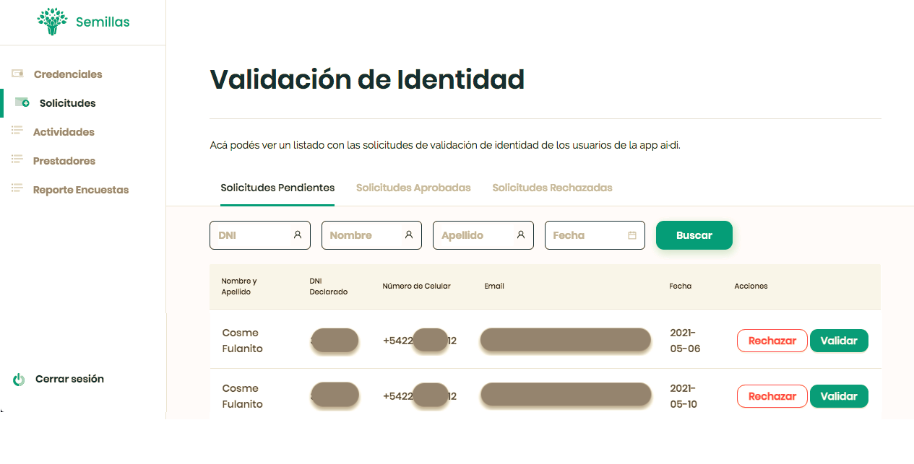
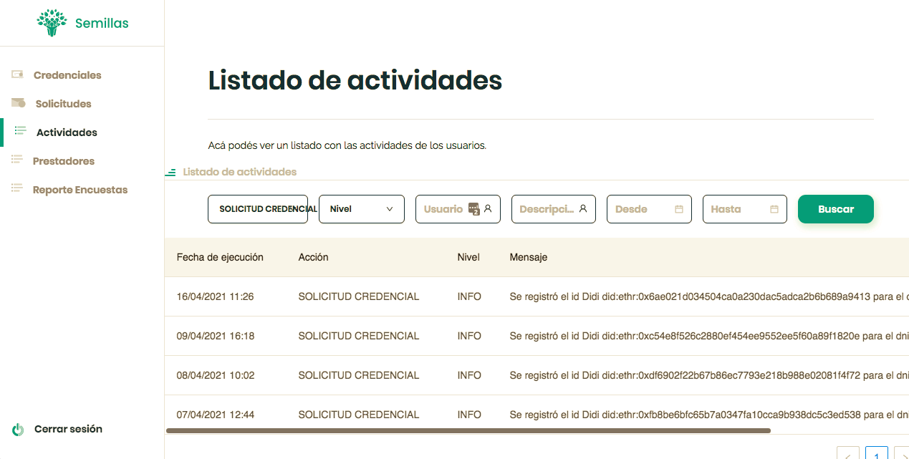
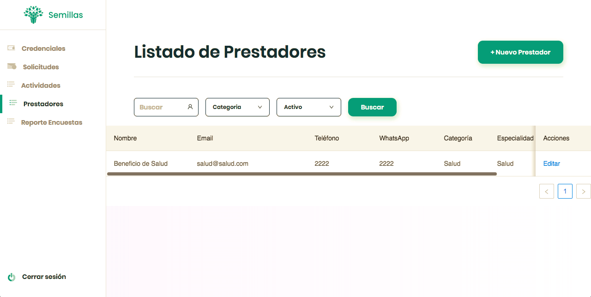

## Emisión Automática de Credenciales
En esta sección se describirá un caso de implementación modelo, de una institución de microfinanzas, para el que se desarrolló una interfáz adicional al emisor manual a fin de automatizar ciertos procesos según las reglas de negocio específicas de este caso.
Lo presentamos a modo de ejemplo, para dar cuenta de la potencialidad de esta plataforma.

### Login

### Credenciales
Al ingresar a la plataforma se visualiza el listado de credenciales.

Como se puede ver en la imagen, este listado cuenta con tres solapas: Credenciales en uso, Credenciales revocadas, Pre-credenciales. Estas solapas refieren a los **estados** de las credenciales que detallaremos a continuación.

Vale rescatar, que durante el proceso del diseño de la implementación, existe la instancia de definición de objetivos, datos de valor que contendrán las credenciales y las reglas de negocios propias del caso. En base a lo definido, se deberán generar templates de credenciales desde la [plataforma issuer](./emisores-plataforma) que serán utilizados durante el desarrollo de la automatización.

Existen distintos tipos de credenciales (identidad, vivienda, familiar, emprendimiento, crediticia, beneficios). Cada una de estas se alimenta de distintas fuentes de datos y tiene sus propias reglas de emisión y revocación.

#### Precredenciales
Llamamos precredencial a una instancia previa a la creación de la misma. En pocas palabras, estas precredenciales contendrán la información necesaria para la creación de la credencial y estarán a la espera de que se informe cuál es el DID (Decentralized Identifier) destinatario al que deberán ser emitidas.

El proceso, en este caso de referencia, es el siguiente:
1. En una primera instancia, la entidad emisora realiza una carga de masiva de datos de encuestas socioeconómicas que realiza a sus clientes. Con esta carga, se generan precredenciales para cada uno de estos clientes.
De esta forma, se podría decir que se "da de alta" a una persona, que llamaremos titular.

2. La plataforma tiene una integración con el sistema de gestión de créditos que utiliza la financiera. Desde este se comunica la información sobre el estado de los créditos de los clientes. En caso de contar con créditos activos, se les crearán precredeciales crediticias a todos aquellos dados de alta en el paso (1). Dadas las reglas de este caso en particular, si un crédito está al día, la persona beneficiaria del crédito tiene acceso a diversos beneficios, por lo que si fuera el caso, se le crean a su vez las precredenciales de 'beneficio'. Si el crédito está en mora, esta precredencial no será creada.
A este paso lo podemos llamar **"sincronización con sistema de gestión y creación de precredenciales crediticias y de beneficios"**.

#### Credenciales en Uso
En el listado de credenciales en uso se visualizan efectivamente las credenciales que fueron emitidas y que no están revocadas.
Para que esto suceda, se deben cumplir las siguientes precondiciones:
* el titular de la credencial debe contar con precredenciales asociadas al número de su documento de identidad.
* el titular de la credencial debe contar con una cuenta en la app ai·di. 
* el titular de la credencial debe compartir su información de número de documento de identidad y DID (para poder hacer esto, debe pasar previamente por un proceso de validación de identidad, descripto más adelante en este documento) desde la app ai·di.
<!-- agregar link al título de validación de identidad -->

En caso de que se cumplan las precondiciones, se emiten las credenciales y el titular las recepcionará en su app ai·di.

#### Credenciales Revocadas
En el listado de credenciales revocadas se visualizan aquellas credenciales que fueron revocadas.
Las credenciales pueden revocarse de forma automática o de forma manual:
* **automática**: esta modalidad responde a las reglas de negocios definidas por parte del emisor. Para seguir con el ejemplo, si un titular tiene uno de sus créditos en mora (o un integrante de su grupo solidario <!--[1] buscar cómo agregar referencia y describir concepto -->  está en mora), se le revocará automáticamente la credencial de beneficio hasta bien salga del estado de mora. Estas validaciones son automáticas, habiendose programado estas reglas e interactuando con la información que provee la API del sistema de gestión.
* **manual**: existe la posibilidad de revocar credenciales por parte del emisor de forma manual. Dado que las credenciales verificables no pueden ser modificadas, en caso de necesitar corregir o modificar algún dato, se deberá revocar manualmente la credencial y emitir una nueva con los datos correctos.

### Recepción de identidad del usuario de ai·di
#### Usuario informa identidad y emisión de credenciales
Desde la app ai·di el usuario deberá informarle al emisor su DID y su número de documento de identidad a fin de recepcionar sus credenciales en su wallet.

Recordemos que este paso es la precondición para la creación y emisión de credenciales, ya que en la instancia de precredencial aún era necesario contar con la información del DID del receptor. De aquí que se puede dar el proceso automático por el cual el sistema busca si para ese número de documento recepcionado, existen precredenciales. En caso afirmativo, se incluye el DID correspondiente a ese número de documento y se emite, pasando de precredencial a credencial.

Desde la app ai·di, una persona puede acceder al proceso de validación de identidad a través de sus datos biométricos. De este proceso, una vez validada con éxito, se generan credenciales identitarias a su nombre.

#### Validación alternativa por parte del emisor
Existe la posibilidad de validar su identidad a través del emisor mediante la declaración de su número de documento de identidad, que, junto al DID, se le informará al emisor. Esto requiere de un proceso por parte de la entidad emisora, de verificar la información recibida y aceptar o rechazar la solicitud que realiza el usuario de la app ai·di.

Desde la sección de **Actividades** del menú lateral, se visualizan los logs de actividades. A modo de ejemplo, la siguiente imagen muestra la instancia en la que se recepciona el DID de un usuario junto a su número de documento de identidad.

#### Beneficios
Una potencialidad identificada en base al modelo del caso de implementación, es la posibilidad de acceder a beneficios con los que cuenta un cliente por estar al día con su crédito (así como los créditos de los integrantes de su grupo solidario).
Se propone la automatización de este acceso, ofrenciendo desde la app ai·di el listado de beneficios a los que el titular tiene acceso bajo las condiciones previamente mencionadas.
Del lado del emisor, existe una sección para cargar la información de los prestadores a los que los beneficiarios tendrán acceso.
Desde la app ai·di se da el primer paso de la solicitud de beneficio: se comparten credenciales relevantes con el prestador del beneficio. Al compartir mediante este flujo, se le envía un mail al prestador con ciertos datos relevantes como ser, nombre, apellido, DNI, y si está habilitado para recibir el beneficio (previa confirmación por parte del dueño de la cuenta). El receptor del mail podrá verificar los datos compartidos y la veracidad de estos gracias a las credenciales verificables. De esta forma se vuelve más eficiente el proceso de acceso a las prestaciones, tanto para quienes acceden como para las entidades involucradas, ya que la instancia de validación de la información ya no supone un involucramiento de todas las partes.
<!-- por favor reformular -->

