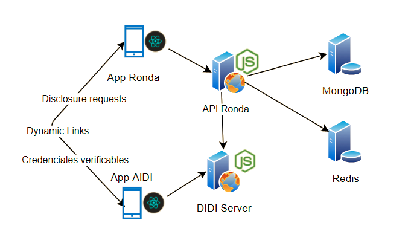
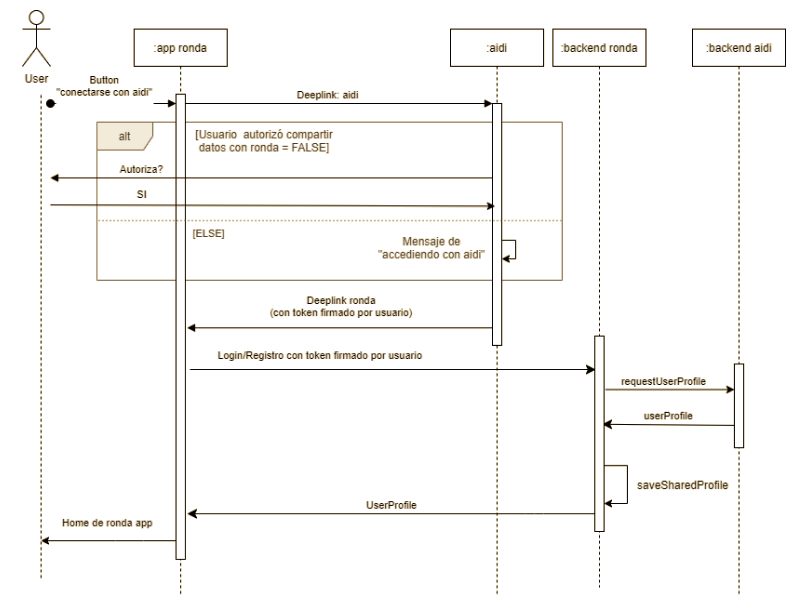

## Descripción
*TBA*

## Diagrama de Arquitectura

## Diagrama de Secuencia registro y acceso de Usuario a ronda app

Se detalla el proceso de registro y acceso a ronda con la autorización de ai·di:

*NOTA*: Por cada requestUserProfile, el backend de ai·di valida el token firmado por el usuario y además valida que el request provenga de una aplicación autorizada (y registrada previamente en ai·di).

## Descripción de procesos implementados para la Integración de aplicaciones

### Gestión de Perfil de usuario
- Generación y registro de perfil desde la aplicación ai·di. 
- El perfil será almacenado y gestionado por ai·di.
- La aplicación de ronda accederá a los datos de perfil de ai.di como una aplicación autorizada.
- Detalle de datos de Perfil de usuario:

|                   | ai·di                                          | ronda                                                                                                            |
|-------------------|------------------------------------------------|------------------------------------------------------------------------------------------------------------------|
| Datos Compartidos | - DID (address)                                | Token firmado por la aplicación.                                                                                 |
|                   | - Email                                        |                                                                                                                  |
|                   | - Número de celular                            |                                                                                                                  |
|                   | - Nombre y Apellido (obtenidos del onboarding) |                                                                                                                  |
|                   | - Foto de usuario                              |                                                                                                                  |
| Datos Propios     | - Credencial de Datos personales               | - Nickname : campo oculto y requerido para RNS. Este campo se autogenera al registrar un nuevo usuario en ronda. |
|                   | - Credencial de  Domicilio Legal               | - Wallet (Address en RSK).                                                                                       |

### Gestión de wallet y RNS de ronda
- Para evitar acoplamiento y permitir que la aplicación ronda sea escalable de manera independiente a ai·di: se mantendrá la wallet de ronda separada de la address de ai·di app.
- Cuando un usuario ingresa por primera vez en la aplicación de ronda se genera el registro de su usuario en ronda y ejecuta el proceso de registro de wallet y RNS para poder operar rondas en la blockchain.
- En caso de fallo en los procesos de registro de wallet y RNS: 
    - El usuario recibirá una notificación con el mensaje de error de registro.
    - El usuario visualizará un pop-up con mensaje de error y call to action para reintentar el registro.  

### Panel de notificaciones
- Toda “push notification“ se almacena como una notificación en el backend y se visualiza desde la pantalla “Notificaciones”.

### Seguridad

- El perfil será accesible por ronda a través de ai·di mediante un JWT. 
- ronda va a tener acceso a los perfiles autorizados por ai·di.
- Los JWT compartidos por ai·di tendrán como subject a ronda.
- El usuario tendrá acceso a ronda siempre y cuando pueda validar los JWT compartidos por ai·di.
- Es decir, para el acceso a los datos y foto de perfil se requiere:
    - Contar con certificado firmado por el usuario.
    - Acceder desde una app autorizada (token de aplicación autorizada).

## Casos de Uso
Se describirán los casos de uso referidos a la integración entre las apps ai·di y ronda.

## Log-in | Acceso de un usuario en ronda desde ronda

#### Descripción
Acceso de un usuario en aplicación mobile ronda desde aplicación ronda

#### Actores
Usuario de aplicación mobile.

#### Descripción del Flujo Básico
1. El Usuario presiona el botón de aplicación ronda.
2. SI  el Usuario tiene un sesión activa de ronda:
    1. El Usuario accede al menú principal de la aplicación ronda.
3. SI NO:
    1. El Usuario visualiza la pantalla de ronda “Iniciar Sesión con ai·di”.
    2. El Usuario presiona el botón “Iniciar Sesión con ai·di”.
    3. SI el Usuario NO tiene aplicación ai·di instalada:
        1. Redirigir al play store.
        2. El usuario instala la aplicación. 
        3. Ir a 3.v.a.
    4. SI el Usuario tiene una sesión activa en ai·di:
        1. El Usuario visualiza la pantalla de ai·di “Permitir acceso desde ai·di”.
        2. El Usuario presiona el botón “Permitir”.
        3. ai·di transfiere un token de acceso a ronda.
        4. ronda valida su token contra DIDI server y obtiene datos de perfil.
        5. El Usuario visualiza la pantalla de ronda “Menú principal”.
    5. SI NO (El usuario NO tiene una sesión activa en ai·di):
        1. El Usuario visualiza la pantalla de ai·di “Log-in inicial”.

        2. SI el usuario presiona botón “Ingresar”:
            1. El Usuario ingresa su email y password de acceso a ai·di.
            2. Ir a 3.iv.a.

        3. SI el Usuario presiona el botón “Recuperar Cuenta”:
            1. El Usuario visualiza un mensaje y presiona el botón “Iniciar”.
                1. El usuario ingresa su email y password de acceso a ai·di.
                2. El usuario presiona botón “Recuperar”
                3. SI autenticación es correcta:
                4. El usuario ingresa número de teléfono
                5. El usuario recibe código de confirmación vía SMS.
                6. El usuario valida SMS.
                7. Ir a 3.iv.a.

        4. Si el Usuario presiona botón “Crear Cuenta”
            1. Genera la cuenta y finaliza la generación de la cuenta.
            2. Ir a 3.iv.a.

## Log-in | Acceso de un usuario en ronda desde ai·di

#### Descripción
Acceso de un usuario en aplicación mobile ronda desde aplicación ai·di

#### Precondición
El usuario tiene ai·di instalada y se encuentra con una sesión iniciada.

#### Actores
Usuario de aplicación mobile.

#### Descripción del Flujo Básico
1. El Usuario presiona el botón “ronda” del menú inferior.
2. SI el usuario nunca inició sesión en ronda:
    1. El Usuario visualiza la pantalla “Accedé a ronda”.
3. Si el usuario accedió alguna vez en ronda:
    1. El usuario visualiza la pantalla “Ver mis rondas”.
4. El usuario presiona el botón “Acceder”.
5. SI el usuario NO tiene instalada la aplicación de ronda
    1. Redirigir al play store.
6. SI NO
    1. El Usuario visualiza el modal de ai·di “Permitir acceso desde ai·di”.
    2. Si El Usuario presiona el botón “Permitir”.
        1. ai·di transfiere un token de acceso a ronda.
        2. ronda valida su token contra DIDI server y obtiene datos de perfil.
        3. SI el token es válido y autorizado por ai·di:
            1. El Usuario visualiza la pantalla de ronda “Menú principal”.
        4. Si NO
            1. El Usuario visualiza un Modal de “Error de autenticación”.
    3. SI NO
        1. El Usuario visualiza un Modal de “Error, requiere Permiso”.

## Creación de Credencial de ronda Iniciada
#### Descripción
Creación de Credencial de ronda Iniciada

#### Precondición
El usuario tiene la aplicación ronda instalada y se encuentra con una sesión iniciada. (Implica ai·di instalada y con sesión iniciada).
El usuario participa de una ronda que acaba de iniciarse.

#### Actores
Usuario de aplicación mobile.

#### Descripción del Flujo Básico
1. La aplicación ronda emite credencial de ronda Iniciada para cada uno de sus participantes.
2. El usuario recibe push notification de aidi por nueva credencial disponible para descargar.
3. El usuario ingresa a la aplicación de aidi por medio de la notificación.
4. La aplicación aidi sincroniza las credenciales.
5. El usuario visualiza la nueva credencial de ronda con estado = iniciada (Credencial con fecha de expiración = fecha de finalización de la ronda).

## Creación de Credencial de ronda Iniciada
#### Descripción
Creación de Credencial de ronda Finalizada

#### Precondición
El usuario tiene la aplicación ronda instalada y se encuentra con una sesión iniciada. (Implica ai·di instalada y con sesión iniciada).
El usuario participa de una ronda que ha llegado a su fecha de finalización. 

#### Actores
Usuario de aplicación mobile.

#### Descripción del Flujo Básico
1. La aplicación ronda emite credencial de ronda Iniciada para cada uno de sus participantes.
2. El usuario recibe push notification de aidi por nueva credencial disponible para descargar.
3. El usuario ingresa a la aplicación de aidi por medio de la notificación.
4. La aplicación aidi sincroniza las credenciales.
5. El usuario deja de visualizar la credencial de ronda con estado = iniciada (Debido a que alcanzó su fecha de expiración).
6. El usuario visualiza la nueva credencial de ronda con estado = finalizada (Credencial que NO expira).

## Ver mis credenciales desde ronda
#### Descripción
Visualización de Credenciales de rondas desde aplicación de ronda

#### Precondición
El usuario tiene la aplicación de ronda instalada y se encuentra con una sesión iniciada.
(Implica ai·di instalada y con sesión iniciada)

#### Actores
Usuario de aplicación mobile.

#### Descripción del Flujo Básico
1. El usuario accede a la pantalla de ronda “Perfil” del usuario. 
2. El usuario presiona el botón “Ver mis credenciales”.
3. El usuario visualiza la pantalla de Credenciales de ai·di en la sección “finanzas”.