### DESCARGA
Ingresar a Play Store desde nuestro celular. Buscar Rondas y seleccionar la siguiente app:

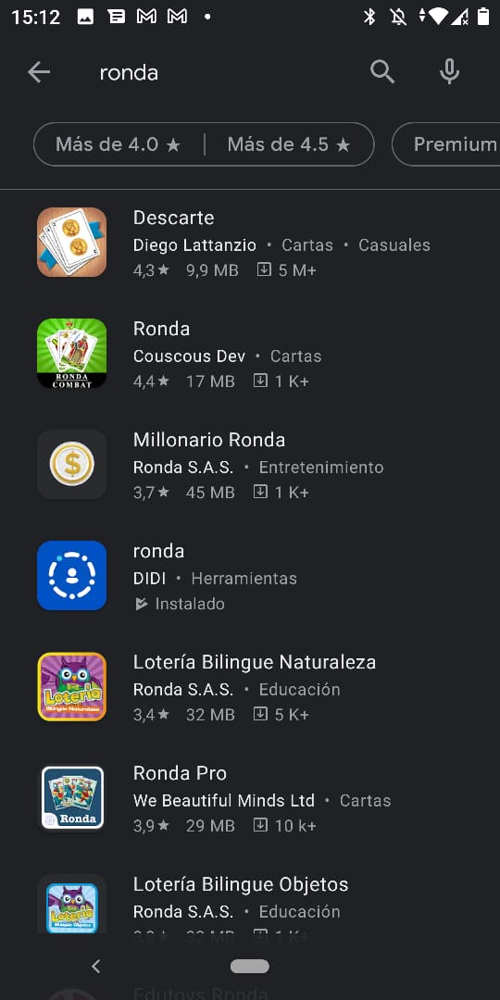

Una vez descargada la app, ingresar a la misma.
### ACCESO A RONDA
Rondas se conecta con ai-di, por lo que es importante descargar y  crear el usuario en ai-di para luego ingresar a Ronda.

Cuando se presiona **Conéctate con ai-di** se abre directo la app ai-di y solicita permiso para compartir el nombre, apellido, número de celular, mail, DID y foto de usuario/a con la app Ronda. Hay que aceptar para  ingresar a Ronda.

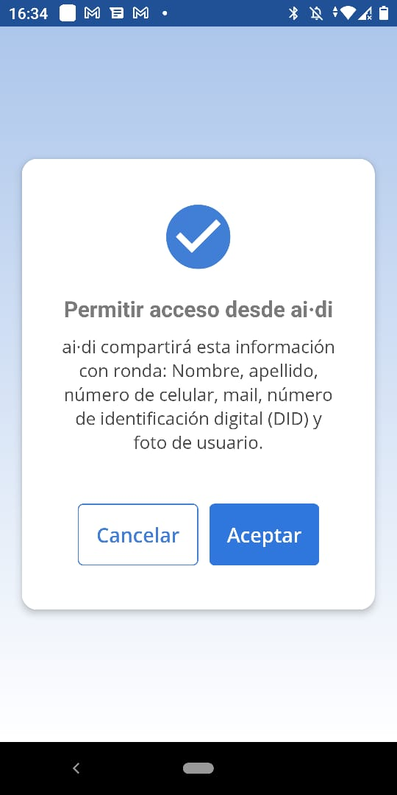

La app se inicia con 3 pantallas de presentación que se corren de derecha a izquierda

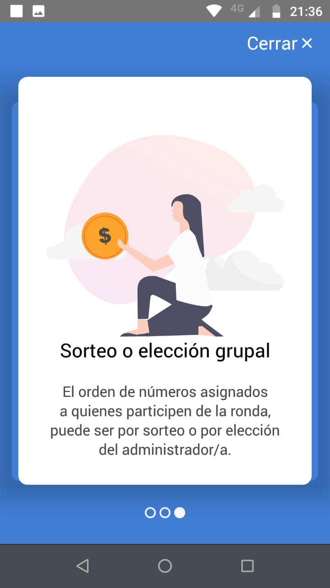

### SECCIONES DE LA PLATAFORMA

#### Perfil

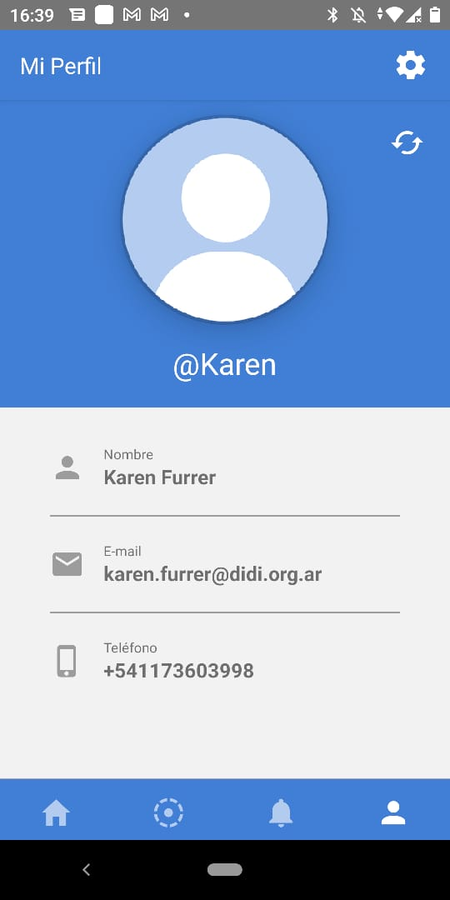

En la sección de perfil se va a poder subir o tomar una foto para personalizar su imagen. También se van a mostrar los datos que son compartidos con ai·di.

#### Notificaciones
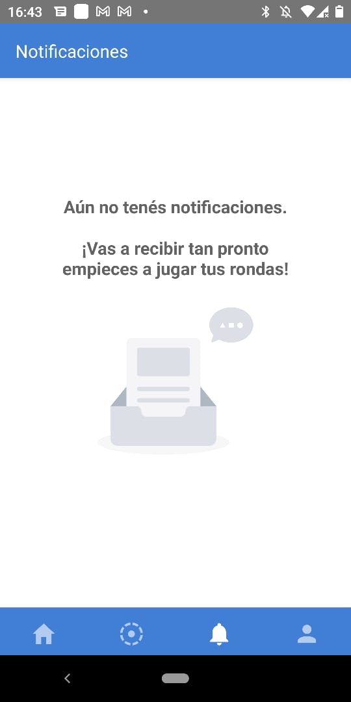

En las notificaciones aparecen los avisos de cada movimiento que suceda en las rondas en las que se está participando.

#### Rondas

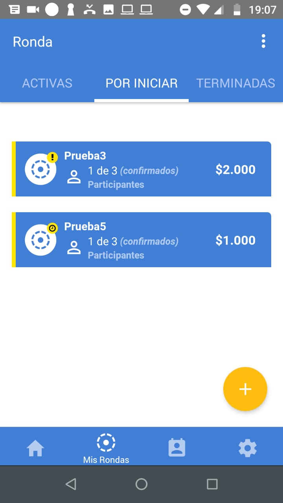
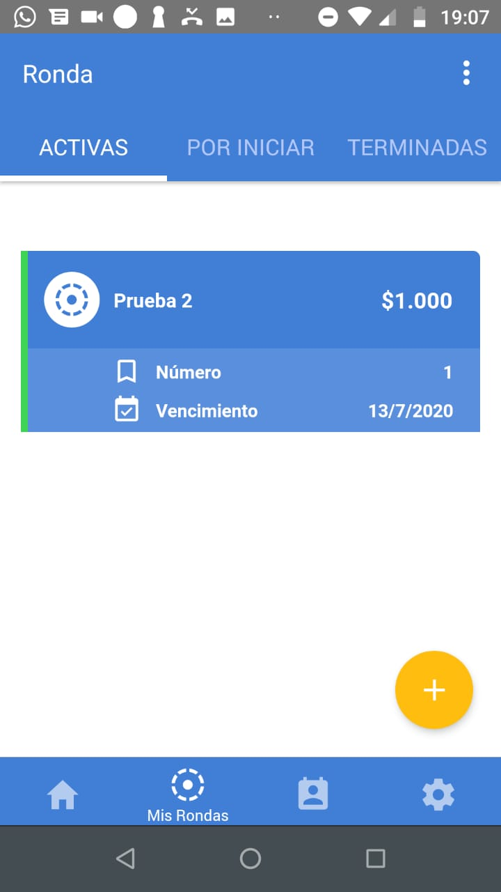
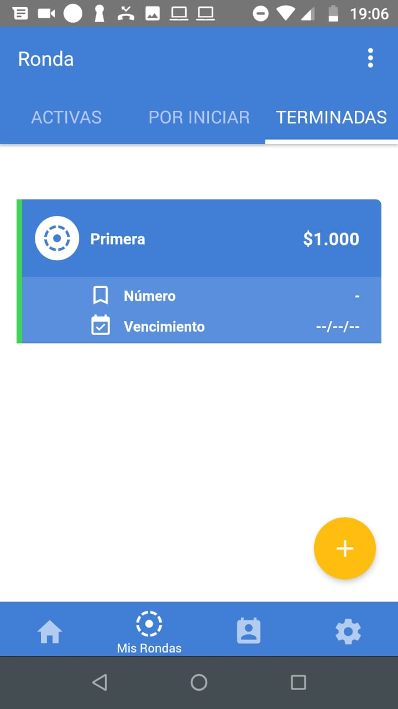

La sección de rondas tiene a su vez 3 solapas además de la función de crear Ronda:

a. **Activas**: Se encuentran las rondas que se están jugando actualmente. 
b. **Por iniciar**: las que están creadas y se figura como participante pero aún no comenzaron. 
c. **Terminadas**: las rondas que ya se jugaron y finalizaron.

#### Menú
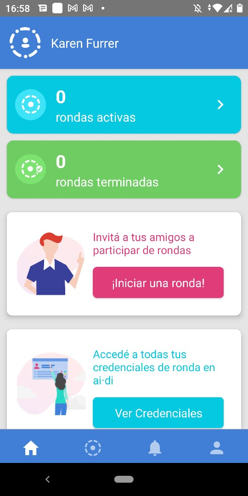

Por último, la sección de Menú tiene un resumen de nuestra actividad, se puede visualizar las rondas activas y las terminadas. Al presionar Ver credenciales nos abre directamente la aplicación ai-di para ver las credenciales alojadas en la sección de finanzas.
La otra opción es la de **Iniciar una ronda**, donde se va a profundizar en el próximo capítulo.

### ¿CÓMO INICIAR UNA RONDA?
Al ingresar a la app de Rondas se verá la siguiente pantalla: 

Para comenzar una nueva ronda hay que presionar en **Iniciar una ronda.** 
Hay varios pasos por completar: A medida que se van realizando cambian de color (de gris a azul) en la barra que se observa en el margen superior.

El primer paso es elegir el **nombre** para identificar la ronda que se va a iniciar.
El siguiente paso pide ingresar la cantidad de números que tendrá la Ronda.
Recordá que los participantes pueden elegir más de un número, siempre y cuando puedan cumplir con ambas cuotas.
Luego tendremos que determinar el **monto** que  cada integrante de la ronda deberá pagar en cada cuota.
Si la cantidad está en alguno de los círculos azules se puede elegir directamente. De lo contrario al tocar el botón gris **Otro** va a permitir escribir directamente el número deseado.

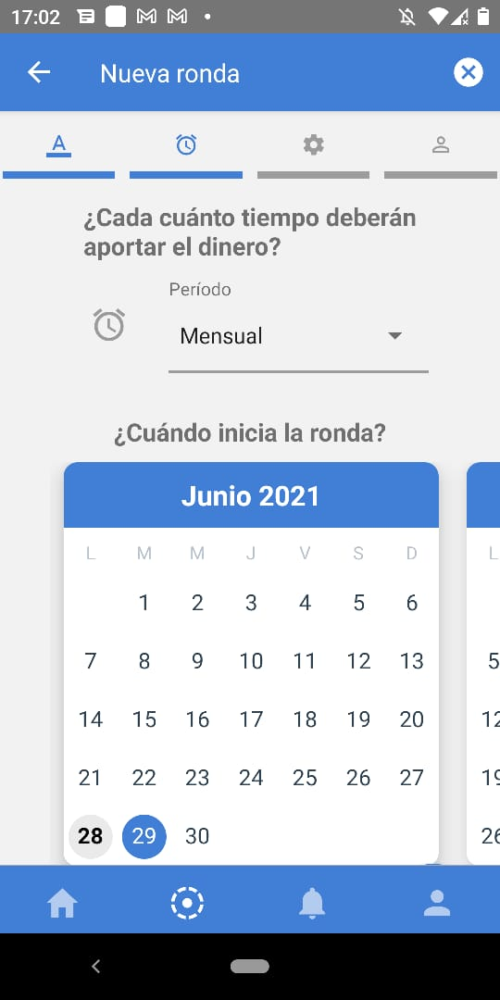

Al cambiar la pantalla nos pregunta sobre la periodicidad del pago. Al desplegar la flecha que se encuentra en **Período** se puede elegir cada cuanto tiempo se debe realizar el pago. Por ejemplo, se puede elegir que el pago sea  semanal, quincenal o mensual.
También elegiremos la fecha en que va a comenzar la Ronda.
Para realizar esta acción se debe seleccionar el día exacto en el calendario que se muestra en la pantalla. Tiene que ser **al menos un día después de la creación de la ronda**
 Podés ir al siguiente mes deslizando hacia la izquierda.

En esta pantalla se puede elegir sortear todos los números entre los participantes (presionando en **Sortear Todos**) o determinar algunos con la opción **Elegir algunos y el resto sorteo** que permitirá ingresar a algún participante en la posición o número deseado.
También en esta misma pantalla vas a poder determinar si las personas que participan de la misma pueden ver a los demás jugadores o no, presionando en **Participantes no visibles**. 
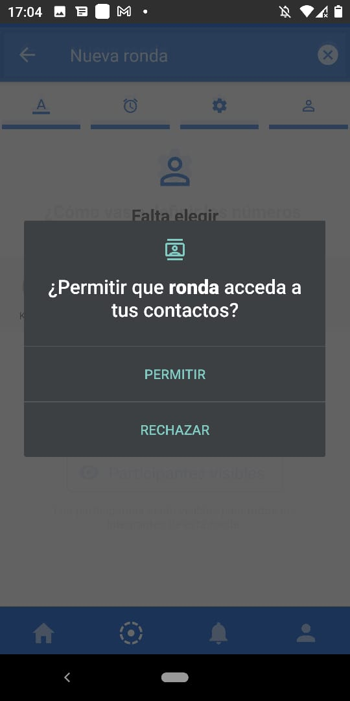
Para elegir a quienes participarán de la ronda, deberás permitir el acceso a tus contactos. 
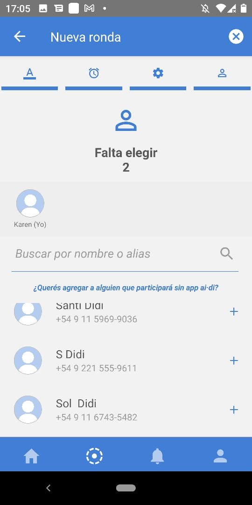
Luego se debe buscar el nombre del contacto tal como fue agendado y agregarlo (no es necesario que tenga la app descargada).
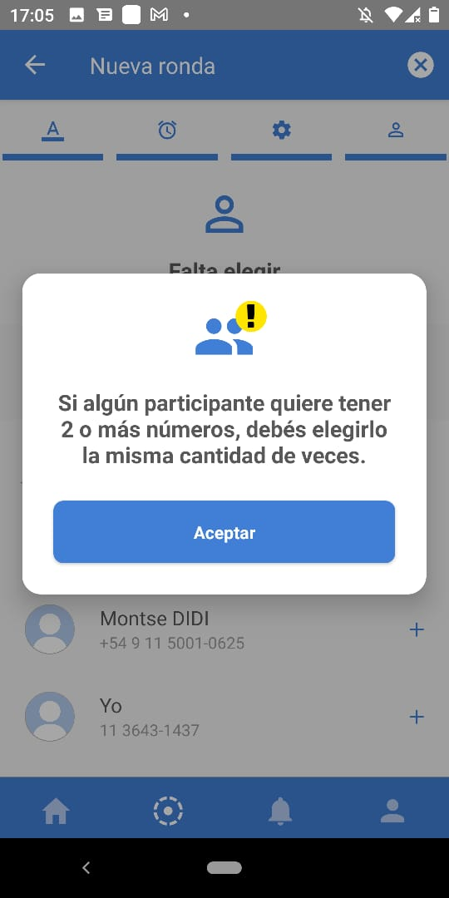
En el caso de que una persona quiera tener dos o más números, se debe ingresar una vez por cada número que quiera adquirir.
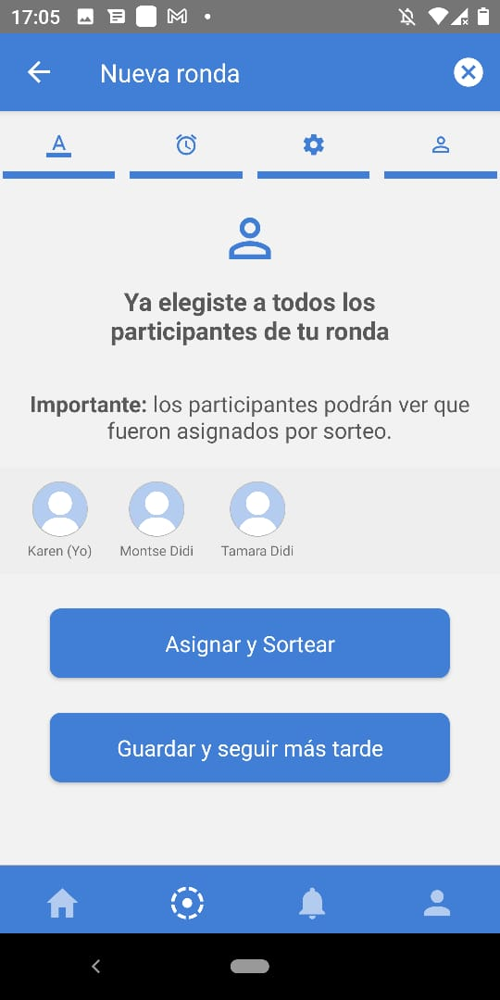
Se puede guardar la información para otro momento (por ejemplo si todavía no estamos seguros de quienes jugarán la ronda) o asignar/sortear los números, según se desee. 

### ASIGNAR NÚMERO
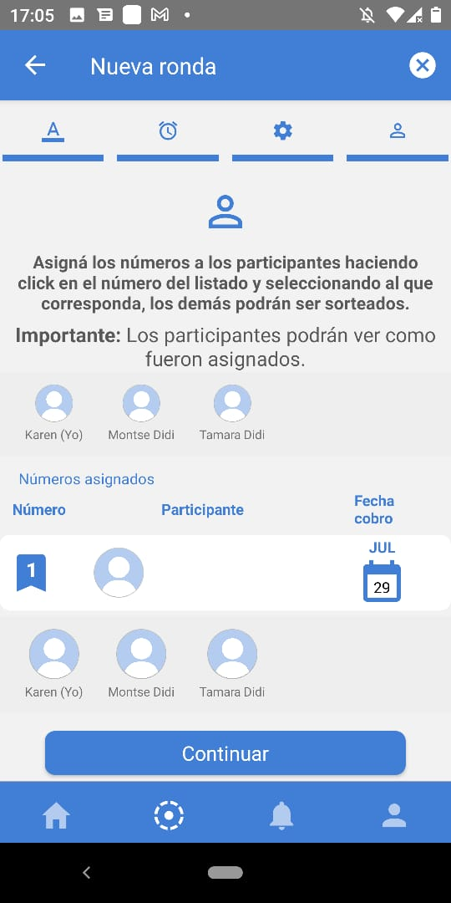
Para asignar un número manualmente se debe presionar en la posición deseada (por ejemplo el número 1). Al hacerlo se desplegarán los nombres de las personas que participan. Al presionar en el nombre de la persona deseada se le asigna ese número automáticamente. 

### SORTEO
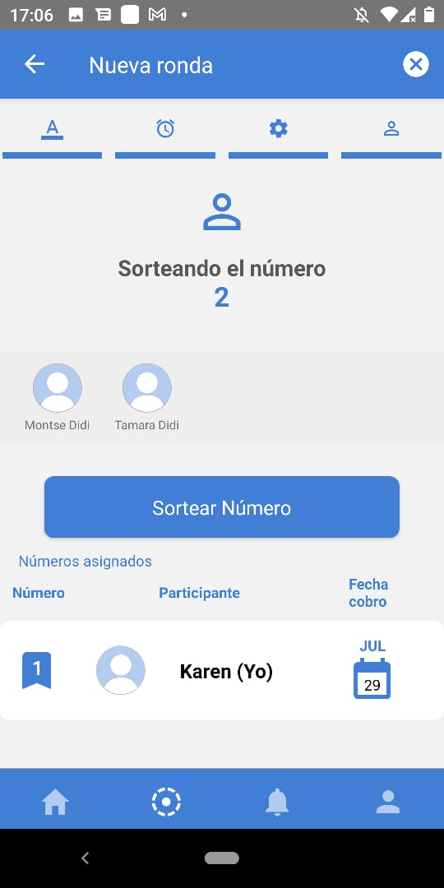
Una vez que se selecciona la opción de **Comenzar el sorteo o sortear número** se irán sorteando en orden de menor a mayor los números. 
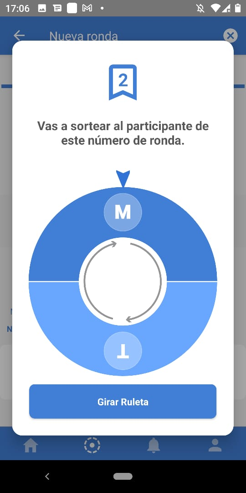
Al presionar **Girar Ruleta** se elegirá un participante al azar. Este se mostrará en la ventana siguiente con el número sorteado.
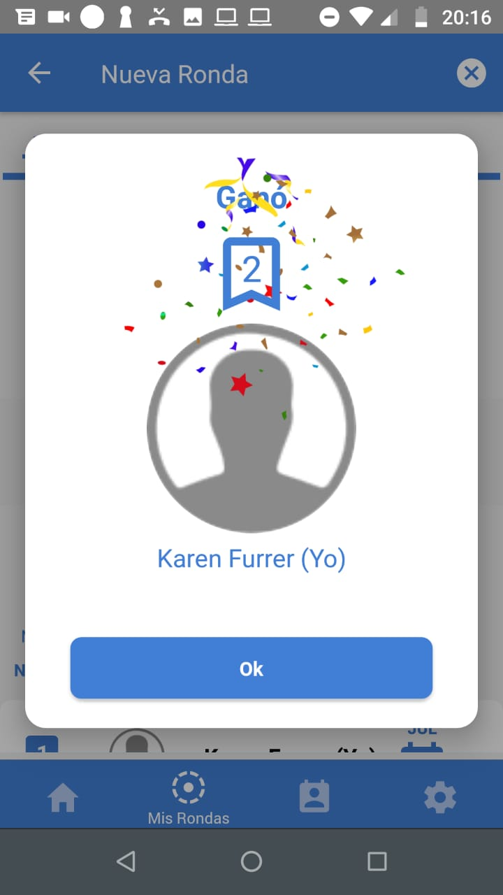
Cada vez que se elija un participante para un número, se podrá visualizar en la pantalla quienes fueron asignados con sus respectivos números y se podrá Seguir Sorteando hasta que todos los números estén asignados. 
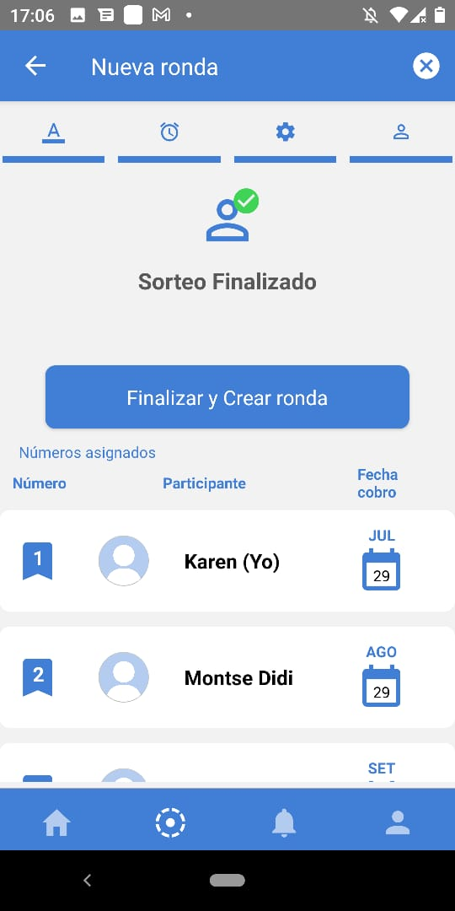
Para crear la Ronda, hay que presionar en **Finalizar y crear ronda**
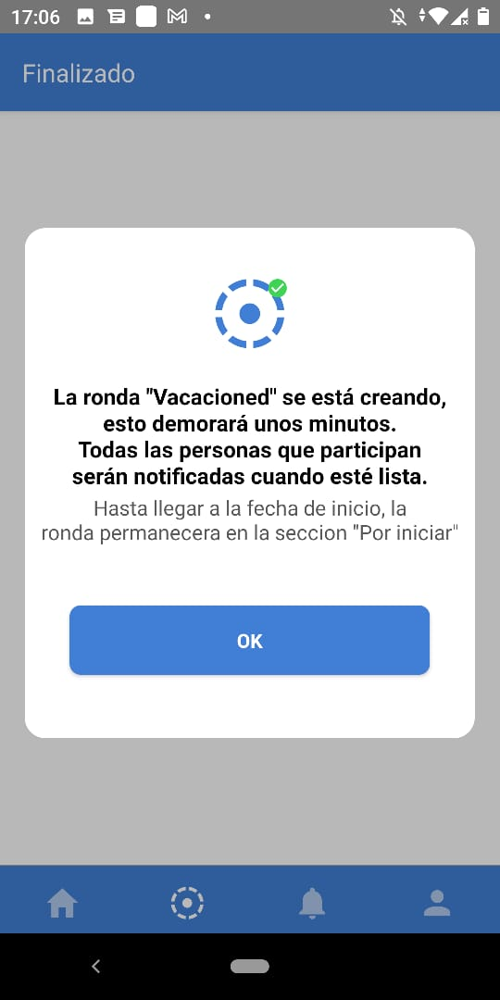
Por último, va a aparecer una pantalla que muestra un cartel de procesando ronda. Una vez que fue procesada, te aparecerá en la sección de “Por iniciar” y también se notificará a todas las personas que participan de la misma. 
Confirmar presionando OK.

### COMENZAR RONDA

Al ingresar en la ronda se puede ver toda su información básica, la misma que fue seleccionada en la instancia de creación. Se puede volver a enviar invitaciones las cuales llegarán por mensaje de texto y también las notificaciones de la app a quienes sean usuarios de Ai-Di. También se puede iniciar la ronda previo a la fecha establecida. Para empezar hay que seleccionar **Comenzar Ronda** y una vez que se procese, la ronda va a cambiar de sección: desde **por iniciar** a **activas**. 

Antes de iniciar la ronda en la información principal aparecen con signo de ! amarillo quienes no confirmaron participación y tic azul los que si.

### ADMINISTRACION DE PARTICIPANTES DENTRO DE UNA RONDA
#### APORTES
Hay dos opciones para acreditar un pago:

* Código QR
* Aceptar el pago

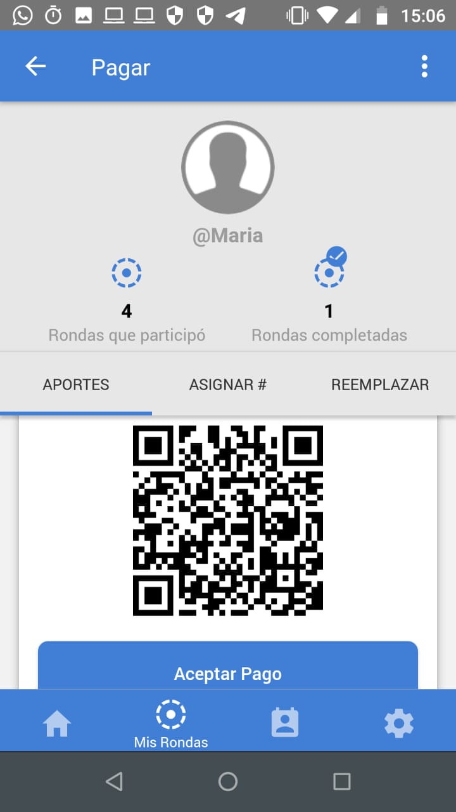
#### Código QR
Si se quiere que el participante de la ronda acredite su pago hay que compartir el código QR que aparece al ingresar en el participante. Se puede escanear de teléfono a teléfono de forma presencial o se puede enviar una captura vía WhatsApp/Telegram/Facebook, cualquier red que permita enviar imágenes (tener en cuenta que se necesitan dos dispositivos para hacer uso del Código QR). 

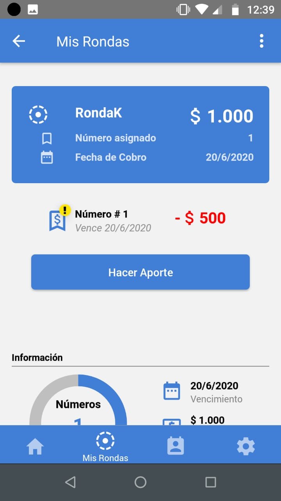
El participante ingresa a la ronda y presiona Hacer aporte. y se abre el espacio para escanear el código QR de quien administra la ronda. Tiene que permitir el acceso a la cámara.

Se va a mostrar la cámara para escanear el código QR de quien administra la ronda. 
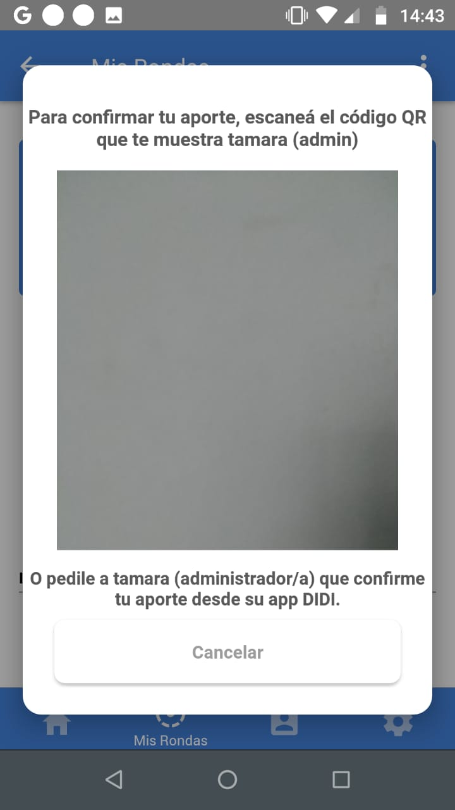

Para abrir el QR del administrador/a tiene que ingresar en el participante que le solicita el código.

#### Aceptar pago
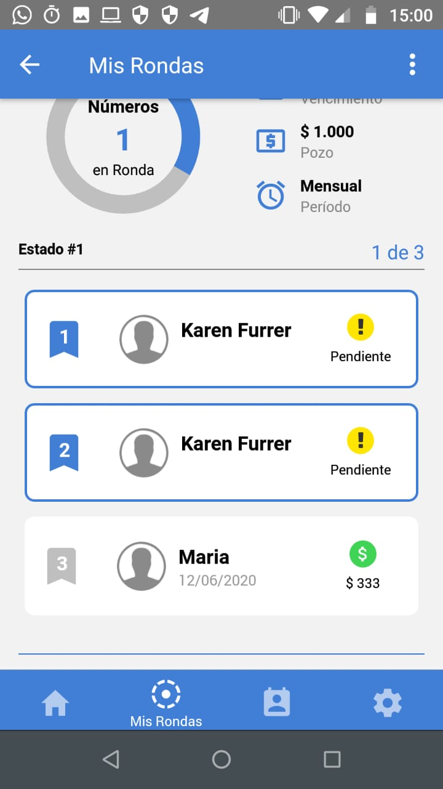
Cuando se ingresa a una ronda se tiene la información básica de la misma y el estado de las personas que participan. Cuando el pago está “pendiente” tiene el “!” amarillo, una vez realizado el pago se pone un “$” verde y se suma el monto en el “dinero recaudado” de la ronda.

Quien cumple el rol de administrador puede acreditar el pago directamente presionando el botón Aceptar pago, luego confirmar. Una vez que el pago se termina de procesar impacta en la pantalla principal de la información de la ronda.

#### Pagar ronda
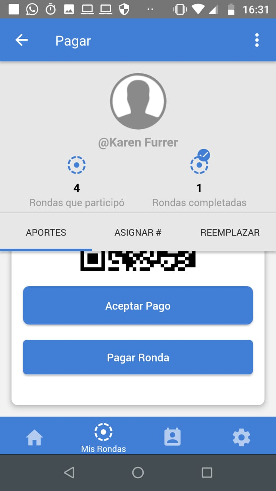
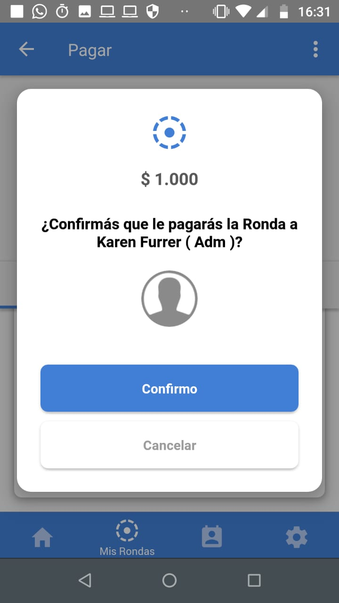
Al presionar Pagar ronda pide confirmación y una vez que se procesa, renueva la información de la pantalla principal (los participantes vuelven al ! amarillo de ronda sin pagar, ya que se es una nueva vuelta y el dinero recaudado vuelve a estar en $0)

### CAMBIAR NUMERO ENTRE PARTICIPANTES DE LA RONDA

Para cambiar el número, se hace desde la página del participante que quiere modificar su número. Se selecciona a la persona/nùmero por el que vamos a realizar el cambio y para finalizar se selecciona **reasignar**.

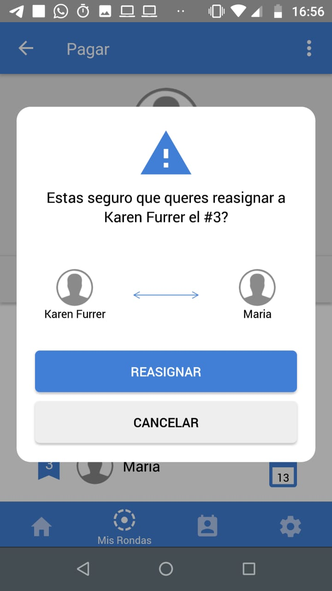

Nos va a mostrar el cartel que vemos en la imagen, significa que el número fue reasignado con éxito.

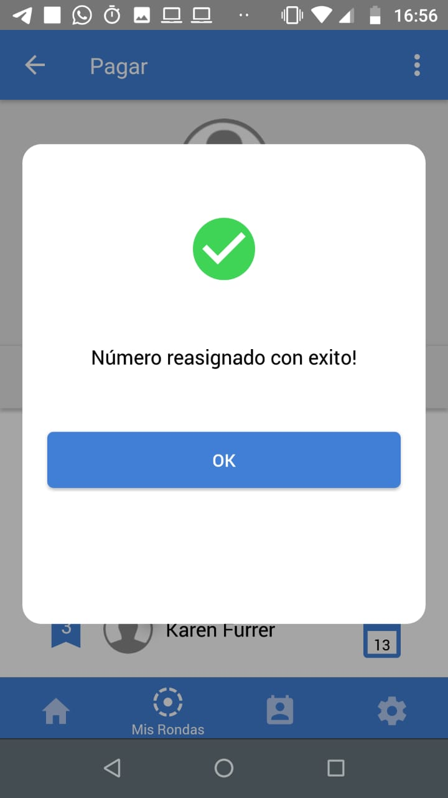

### CAMBIAR A UN MIEMBRO DE LA RONDA POR UNO NUEVO
Para reemplazar a un participante, se hace desde la página del participante que se va a cambiar. 

Desde la pestaña de Reemplazar, elegir de nuestra lista de contactos al nuevo participante y seleccionar la opción de reemplazar.
Falta elegir reemplazo desde contactos y confirmar

Hasta que el reemplazante no apruebe el cambio, el responsable seguirá siendo el miembro original.

### ACEPTAR INVITACIÓN DE RONDA
Cuando alguien invita a una ronda, aparece en “por iniciar” o “activas” de acuerdo al estado de la misma, al ingresar se puede decidir si aceptar o rechazar la invitación. 
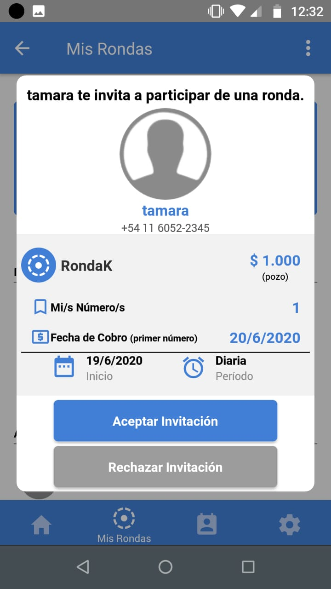

